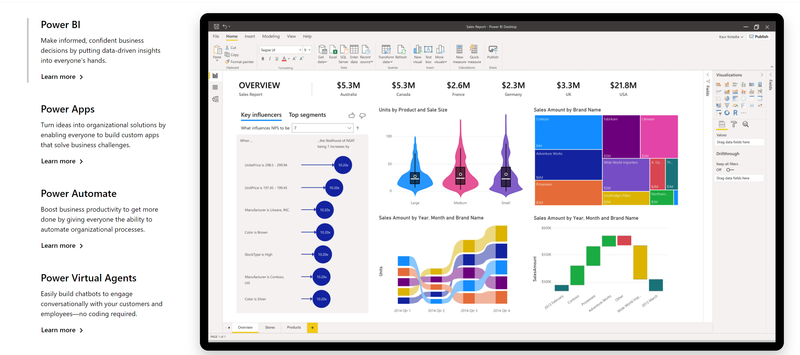
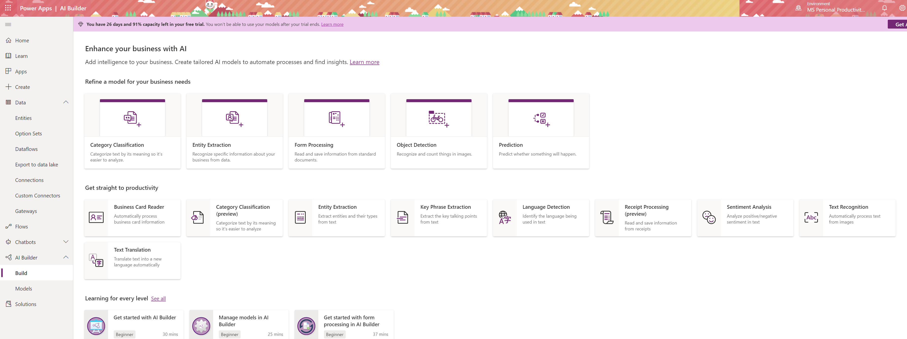

# What is Power Platform?

Power Platform is a set of **tools,** **API**'s and **SDK**'s that helps you **analyze your data** and build **automations,** **applications** and **virtual agents** with or without having to write any code.

### What are Power Apps?

Power Apps is a set of tools that allows you to create applications with a drag and drop UI and easy integration of your data and 3rd party APIs through connectors.  

A [**connector**](https://docs.microsoft.com/connectors/connectors?WT.mc_id=aiml-8438-ayyonet) is a proxy or a wrapper around an API that allows the underlying service to talk to Microsoft Power Automate, Microsoft Power Apps, and Azure Logic Apps. It provides a way for users to connect their accounts and leverage a set of pre-built **actions** and **triggers** to build their apps and workflows. For example, you can use [Twitter connector](https://docs.microsoft.com/connectors/twitter/?WT.mc_id=aiml-8438-ayyonet) to get tweet data and visualize it in a dashboard or use [Twilio connector](https://docs.microsoft.com/connectors/twilio/?WT.mc_id=aiml-8438-ayyonet) to send your users text messages without having to be an expert in Twitter or Twilio APIs or having to write a line of code. 


Check out the[ list of connectors for Power Apps](https://docs.microsoft.com/en-us/connectors/connector-reference/connector-reference-powerapps-connectors?WT.mc_id=aiml-8438-ayyonet) to see all the APIs that are available. Notice [Power Automate](https://docs.microsoft.com/connectors/connector-reference/connector-reference-powerautomate-connectors?WT.mc_id=aiml-8438-ayyonet) or [Logic App connectors](https://docs.microsoft.com/connectors/connector-reference/connector-reference-logicapps-connectors?WT.mc_id=aiml-8438-ayyonet) might not be the same.


### What is AI Builder?

**AI Builder** is one of the additional features of Power Apps. With AI Builder, you can **add intelligence to your apps** even if you have no coding or data science skills. 

#### What are some of the use cases for AI Builder?

You can use pre-trained models to:

* **Detect** **objects** from images
* **Analyze** your customers **sentiment** from feedback
* Detect **keywords** from text
* **Extract** **specific** **information** about your business from text

