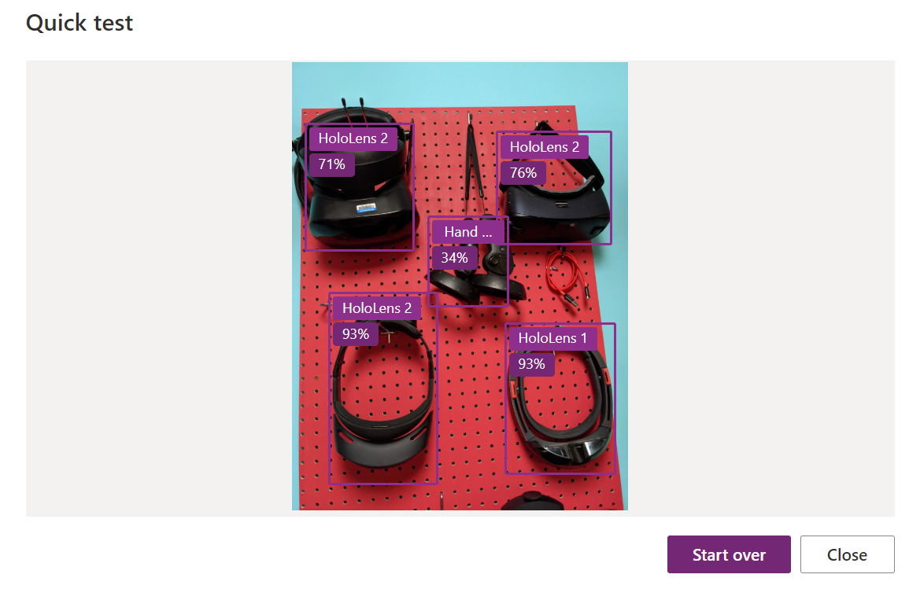

# What could go wrong?

### Training your data for bias

If we think about our Custom Vision, [Mixed Reality Headset detection project example](project/how-to-create-an-application-with-ai-whiteout-coding/), we can train our data to be biased to detect HoloLens 2 or other headsets by giving more image samples for the specific headset. As a result the application will detect the headset with most images\(ex: HoloLens 2\), even when it is not the actual type of the headset in the image.

