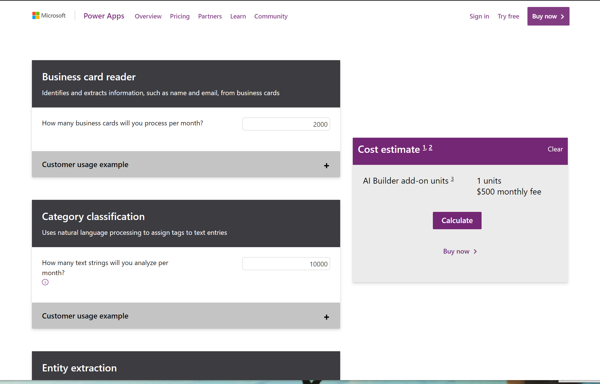

# How to create an application with AI whiteout coding?

You might have an idea for an application using AI and not have anyone to build it. You might be a programmer and want to try out your ideas before start writing code. No matter what your coding skill level is, if you want to prototype an application with AI, Power Apps and AI Builder is a fast and easy option. 

### Can I use Power Apps and AI Builder for production?

Yes you can. As any tool that does things magically, AI Builder in Power Apps comes with a cost. That doesn't mean you can't [try your ideas out for free](https://powerapps.microsoft.com/?WT.mc_id=aiml-8438-ayyonet). If you want to go to production with Power Apps, it is a good idea to consider the costs. Thankfully there is an app for that.[ AI Builder Calculator](https://powerapps.microsoft.com/ai-builder-calculator/?WT.mc_id=aiml-8438-ayyonet) let's you input what **AI tools you will need** and **how many users** will be accessing your app's AI features and gives you the price it will cost you. 

