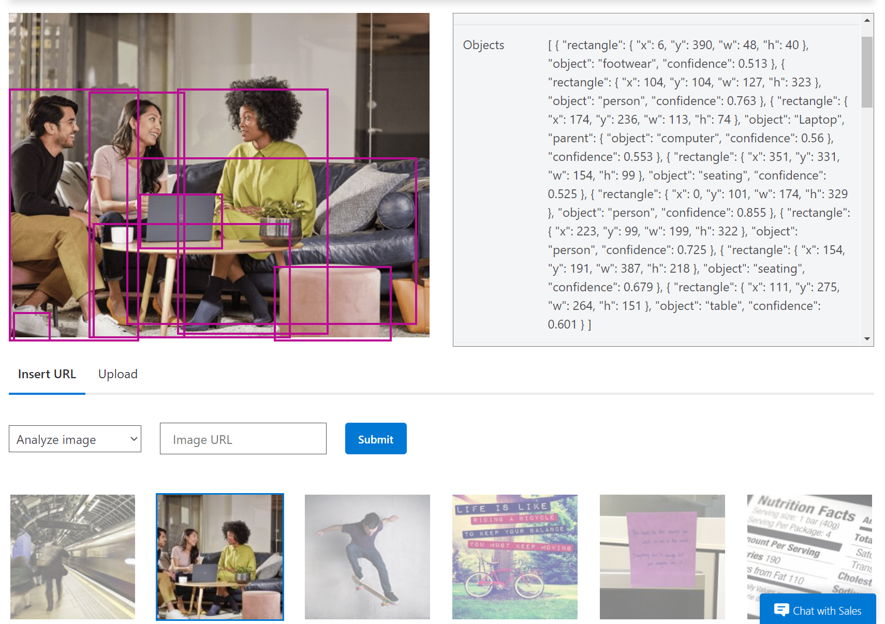

# What is Object Detection?

AI Builder Object detection is an AI model that you can train to **detect objects in pictures**. AI models usually require that you provide samples of data to train before you are able to perform predictions. Prebuilt models are pre-trained by using a set of samples that are provided by Microsoft, so they are instantly ready to be used in predictions.

Object detection can detect up to **500 different objects in a single model** and support **JPG, PNG, BMP** image format or photos through the Power Apps control.

### How to try out Object Detection capabilities?

You can try out and see how object detection works before having to create and accounts or apps yourself on the [Azure Computer Vision](https://azure.microsoft.com/services/cognitive-services/computer-vision/?WT.mc_id=aiml-8438-ayyonet#features) page. 

