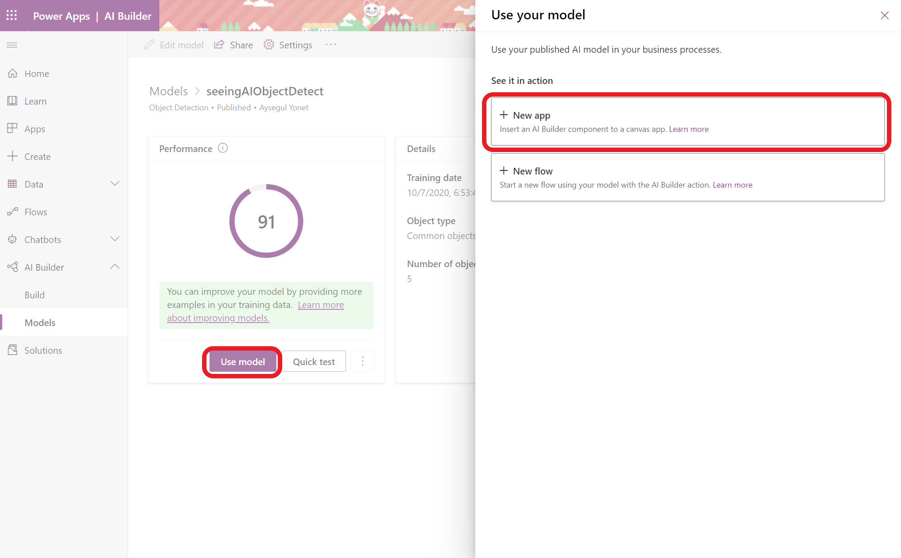
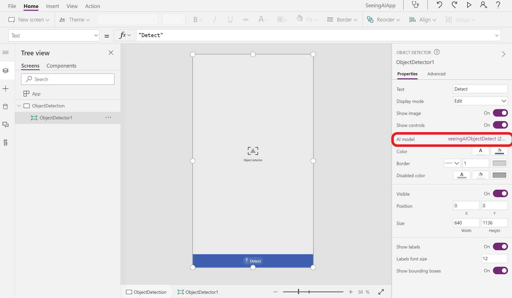
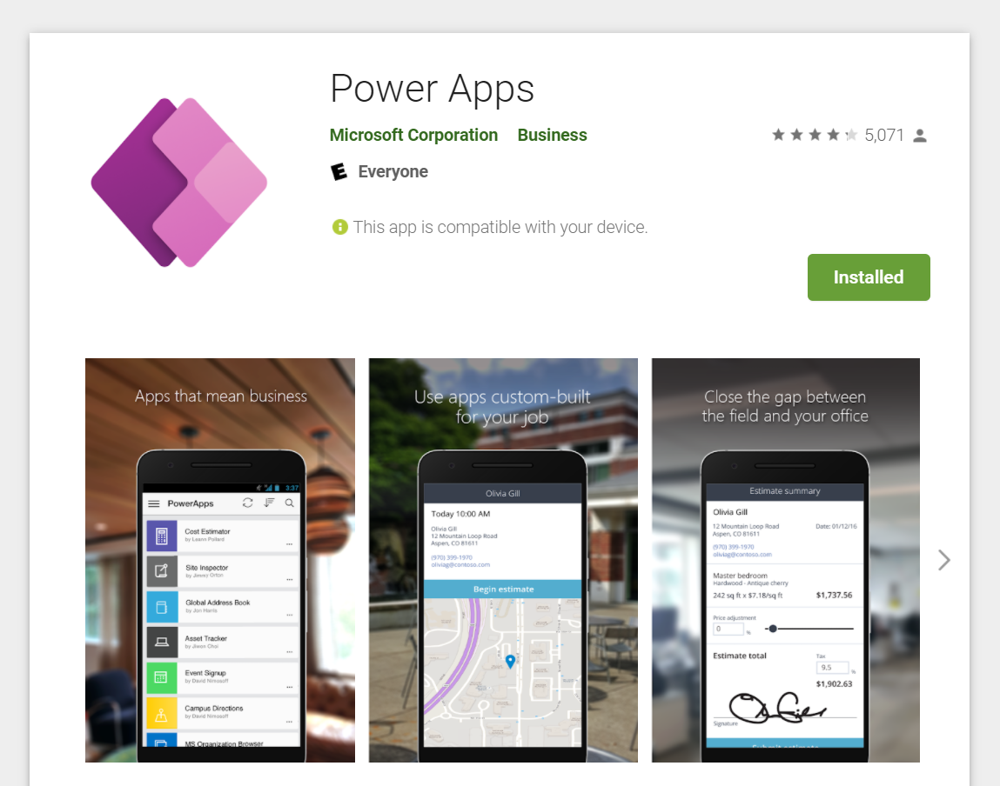

# How to use your Custom Vision model in a Power App?

Once you are happy with you model's performance, you can add it to a new app by choosing **Use model** and **New app.** 

You will be redirected to Power App editor and an Object Detection component that uses your model will be added automatically. In the editor, you can add new pages to navigate, design and customize your pages.

Once you are happy with the design, you can publish and share your app. You can use your new app by downloading Power Apps from [Apple](https://apps.apple.com/us/app/power-apps/id1047318566), [Android](https://play.google.com/store/apps/details?id=com.microsoft.msapps&hl=en_US&gl=US) or [Microsoft](https://www.microsoft.com/en-us/p/power-apps/9nblggh5z8f3?ocid=9nblggh5z8f3_ORSEARCH_Bing&rtc=1#activetab=pivot:overviewtab) stores. Once you sign in, your app will be listed in the mobile Power Apps. 

