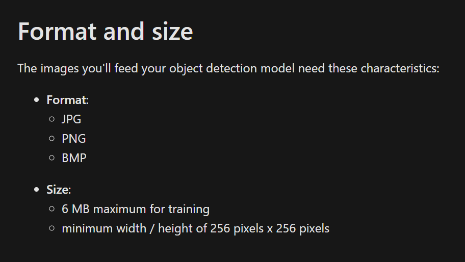

# How to detect objects from images?

To start creating your AI model for your app, sign in to [Power Apps](https://powerapps.microsoft.com/?WT.mc_id=aiml-8438-ayyonet) and click on AI Builder on the left hand menu. Select Object Detection from the "Refine Model for your business needs" option.

