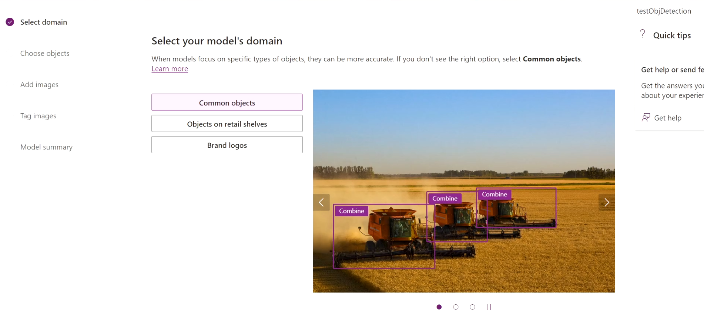
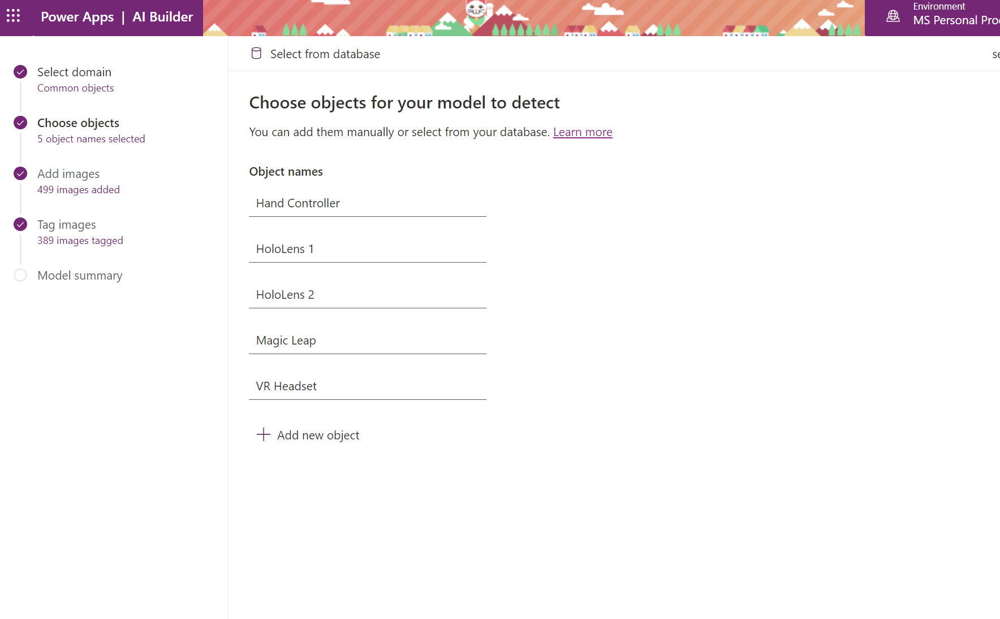

# How to detect objects from images?

To start creating your AI model for your app, sign in to [Power Apps](https://powerapps.microsoft.com/?WT.mc_id=aiml-8438-ayyonet) and click on AI Builder on the left hand menu. Select Object Detection from the "Refine Model for your business needs" option.

Name your new AI model with a unique name. Select Common Objects and proceed to next section.

Name the objects that you are going to detect. 

Upload images that contains the object you will detect. To start with you can upload **15 images for each object**. 

Make sure each object has approximately the same amount of images tagged. If you have more examples of one object, the training data will be likely to detect that object when it is not. 

