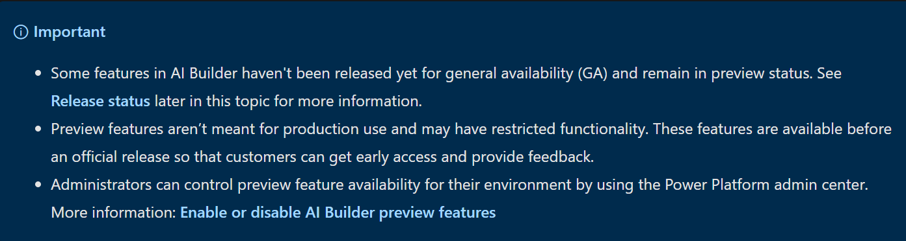

# Is AI Builder the right choice?

Great question! There are so **many tools** out there and **many ways to do the same thing**. How do you know which one is the right solution before investing time and effort?

I have a rule of thumb when I want to build something, use what ever is available and easy to use first. When your needs exceeds what the tool you are using covers, look into another solution or building it yourself. 


Use the tool **easiest** to get started when you are building your idea. When your **needs exceeds the capabilities** of the tool you are using, find a solution that enables you. Don't invest in building things from scratch before you know it is worth it to do so.


For example, if you have an app idea, it is better to have a prototype running as easily as possible. You can test your ideas before investing your time into building custom designed UI or features. In our specific case, you can first prototype your app with the **drag and drop UI** of **Power Apps** and using **prebuild AI models**. When your specific needs surface, such as recognizing a particular object or keyword, you can invest your time into creating your custom models to train for the **object** or **keyword detection**.

### Can I use Power Apps and AI Builder for production?

Yes you can. As any tool that does things magically, AI Builder in Power Apps comes with a cost. That doesn't mean you can't [try your ideas out for free](https://docs.microsoft.com/powerapps/maker/signup-for-powerapps?WT.mc_id=aiml-8438-ayyonet).

#### What will my production app cost?

If you want to go to production with Power Apps, it is a good idea to consider the costs. Thankfully there is an app for that.[ AI Builder Calculator](https://powerapps.microsoft.com/ai-builder-calculator/?WT.mc_id=aiml-8438-ayyonet) let's you input what **AI tools you will need** and **how many users** will be accessing your app's AI features and gives you the price it will cost you. 

#### What are preview features?

AI Builder was released for **public preview** on June 10, 2019, in Europe and the United States. Preview release features are subject to change and may have restricted functionality before the official release for general availability. Preview releases are not meant for production use. You can try them out and influence the final product by giving feedback. 

The **General Availability\(GA**\) release will occur in a phased manner, with some features remaining in **preview status** while others are released for GA. You can check out the release status on the [AI Builder documentation](https://docs.microsoft.com/ai-builder/overview?WT.mc_id=aiml-8438-ayyonet#release-status).

