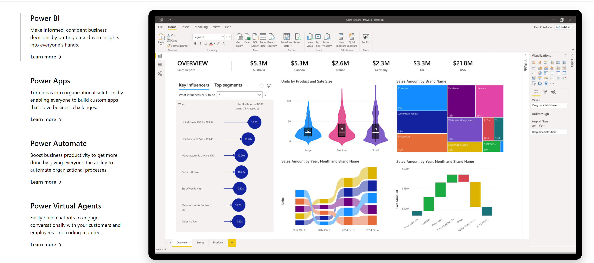

# What is Power Platform?

Power Platform is a set of **tools,** **API**'s and **SDK**'s that helps you **analyze your data** and build **automations,** **applications** and **virtual agents** with or without having to write any code.

### What is Power Apps?

Power Apps is a set of tools that allows you to create applications with a drag and drop UI and easy integration of your data and 3rd party APIs through connectors. 

### What is AI Builder?

AI Builder is one of the additional features of Power Apps. With AI Builder, you can add intelligence to your apps even if you have no coding or data science skills. 

#### What are some of the use cases for AI Builder?

You can use pre-trained models to:

* Detect objects from images
* Analyze your customers sentiment from feedback, 
* Detect keywords from and 
* Extract specific information about your business from text

