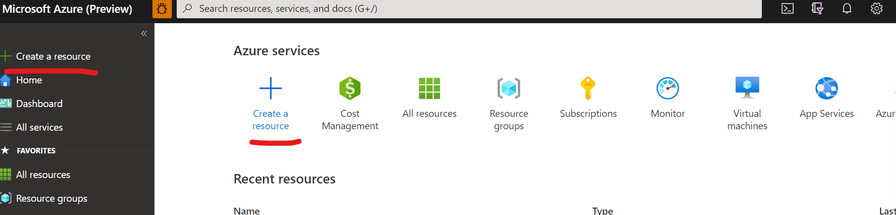

# Creating an Azure Resource

* [ ] Go to [Azure Portal](https://portal.azure.com/?WT.mc\_id=aiml-8567-ayyonet): [https://aka.ms/AzureDevPortal](https://aka.ms/AzureDevPortal)
* [ ] Click create resource and search for Speech or Cognitive Services

