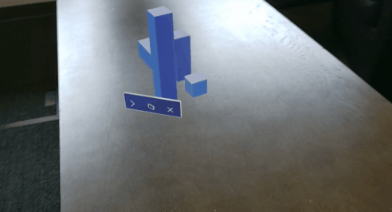

# What is an App Bar?

The App bar is a object-level menu containing a series of buttons that displays on the bottom edge of a hologram's bounds. This pattern is commonly used to give users the ability to remove and adjust holograms. The App bar was designed primarily as a way to manage placed objects in a user's environment. Coupled with the bounding box, a user has full control over where and how objects are oriented in mixed reality.

#### The App bar follows the user 

Since this pattern is used with objects that are world locked, as a user moves around the object the App bar will always display on the objects' side closest to the user. While this isn't billboarding, it effectively achieves the same result; preventing a user's position to occlude or block functionality that would otherwise be available from a different location in their environment.

