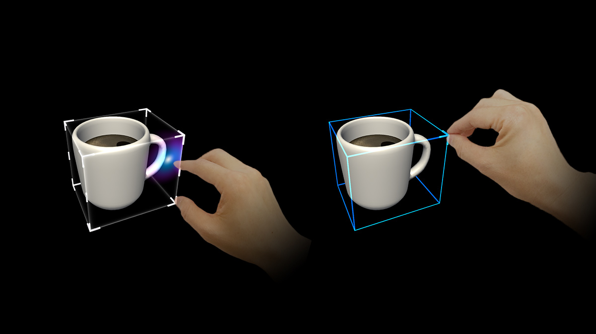
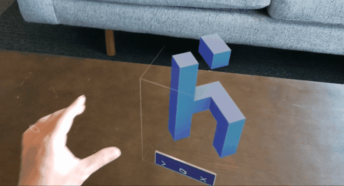
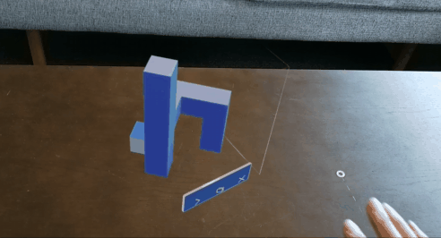

# What is the Bounding box?

Bounding is the standard interface for object manipulation in Mixed Reality. It provides the user an affordance that the object is currently adjustable. On HoloLens 2, the bounding box works with direct hand manipulation and responds to the user's finger's proximity. It shows visual feedback to help the user perceive the distance from the object.

### Scaling an object

