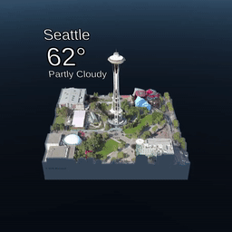
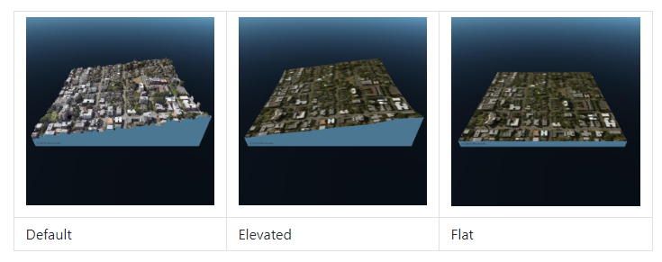

# Lesson 5

## Concepts

### Why is spatial data important?

### What are some good spatial visualizations for Mixed Reality?

### What is Bing Maps SDK?

## Project

### How to include Bing Maps SDK into your project?

### How to sign up as a developer for Bing Maps?

### How to create and configure your first map in unity?

### How to style your map using render settings?

### What is a Map Terrain Type?

### How to add hand interactions for scaling and rotation?

### How to style bounding box?

### How to add a slider for lat-long input?

### How to animate your map?

### How to add labels to your map?

### How to customize the map texture?

## What could go wrong?

### Does the dimensions of the map effect performance?

Larger map dimensions will require more data to be downloaded and rendered. This will affect the overall performance of the app. It is recommended to stay with the default settings or smaller, or only increase the map dimensions on devices that are capable. Regardless, the map dimensions are clamped to a maximum size.

### Does Map Terrain Type effect performance?

 The `Flat` map terrain type requires the least amount of performance overhead. Both elevation and high resolution 3D models are disabled. The map terrain surface will be flat.

