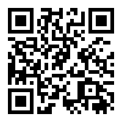

# Unity Lessons

Short link: [aka.ms/MixedRealityUnityLessons](https://aka.ms/MixedRealityUnityLessons)

* [Lesson 1](lesson1/):  Introduction to Mixed Reality Applications and Development.
* [Lesson 2](lesson-2/):  Introduction to Mixed Reality Developer Tools and 3D Concepts.
* [Lesson 3](lesson-3/):  Working with Hand Interactions and Controllers.
* [Lesson 4](lesson-4/):  Eye and Head Gaze Tracking.
* [Lesson 5](lesson-5/):  Spatial Visualization using Bing Maps.
* [Lesson 6](lesson-6/):  Working with REST APIs.
* [Lesson 7](lesson-7/):  Azure Spatial Anchors and Backend Services.
* [Lesson 8](./):  Displaying Spatial Anchors on a map.
* [Lesson 9](./):  Working with QR codes.
* [Lesson 10](lesson-11.md): Working with Scene Understanding.
* [Lesson 11](./): Getting Started with AI.
* [Lesson 12](lesson-12/): Project Discussion and Case Studies.

