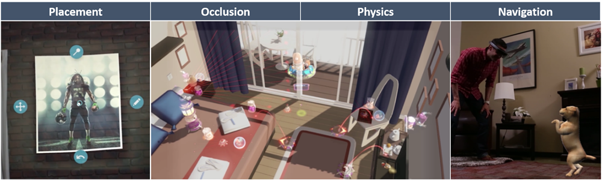

# What is Scene Understanding?


Note that Scene Understanding SDK is only available for **HoloLens 2**.


The goal of **Scene understanding** is to **transform** the **un-structured environment sensor data** that your Mixed Reality device captures and to convert it into a powerful but abstracted representation that is intuitive and easy to develop for. [The Scene Understanding SDK](https://aka.ms/UnitySceneUnderstandingSDK) acts as the communication layer between your application and the Scene Understanding runtime. It's aimed to mimic existing standard constructs such as 3d scene graphs for 3d representations and 2D rectangles/panels for 2d applications. While the constructs Scene Understanding mimics will map to concrete frameworks you may use, in general SceneUnderstanding is framework agnostic allowing for interop between varied frameworks that interact with it.

