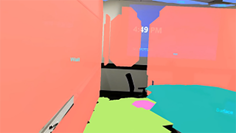
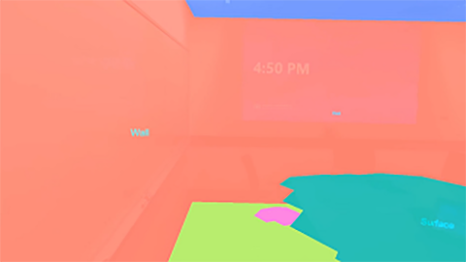

# What is SceneQuads?

**SceneQuads** are computed **2D primitives** that describe **a flat surface** and has an **API** designed to be used to help **placement of the objects**. 

When using the **triangle mesh** from **Spatial Map** to perform placement, one had to scan all areas of the quad and perform **hole filling/post-processing** to identify good locations for object placement. This is not always necessary with Quads, as the Scene understanding runtime is capable of inferring which areas of the quad that were not scanned, and **invalidate areas of the quad that are not part of the surface**.

