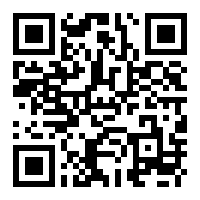

# 02 - Mixed Reality Developer Tools and Concepts

Short link: [aka.ms/UnityMixedRealityDeveloperTools](https://aka.ms/UnityMixedRealityDeveloperTools)

### Overview

In this section, we will go through the developer tools and how to get started with debugging our applications.&#x20;

Second part of the course is focused on creating and using 3D assets in your applications.

* ****[**Concepts**](concepts/)****
* ****[**Project**](project/)****
* ****[**What could go wrong?**](what-could-go-wrong.md)****
* ****[**Resources**](resources.md)****

