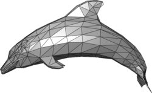
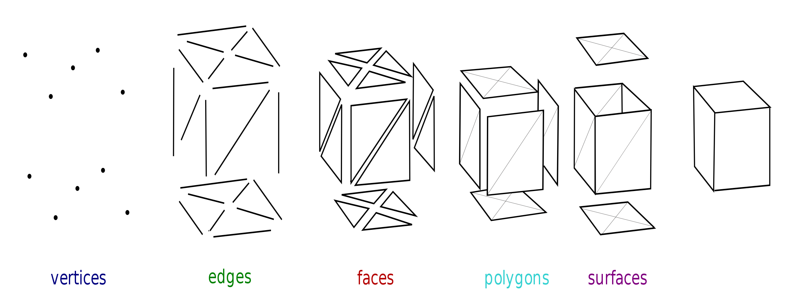

# What makes a 3D model? What are Polygons, Splines, Vertices, Meshes and Materials?

A **3D model** is a digital representation of a real world object. Representing a 3D object requires you to get to know some parts that makes up the 3D object.

 **Polygonal modeling** is an approach for modeling objects by representing or approximating their surfaces using polygon meshes.

Objects created with polygon meshes must store different types of elements. These include **vertices**, **edges**, **faces**, **polygons** and **surfaces**.

### Why are polygons important?

The more edges and faces a model has, detail if the model improves. On the other hand, having a high polygon count model will reduce the performance of your app. The calculation that needs to be done to render the model is expensive. 

