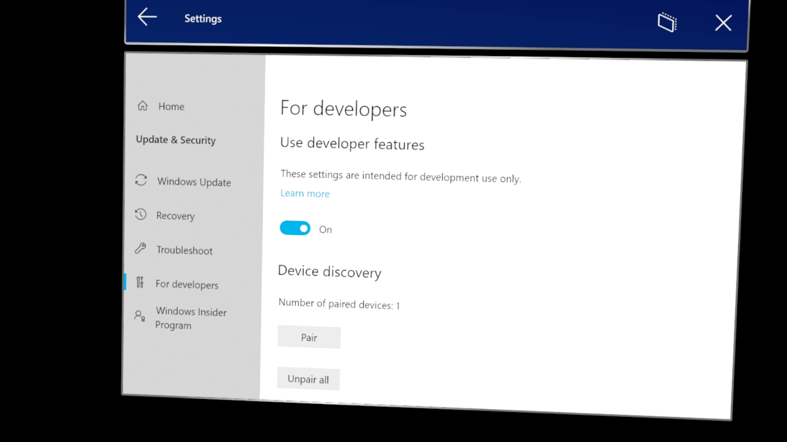
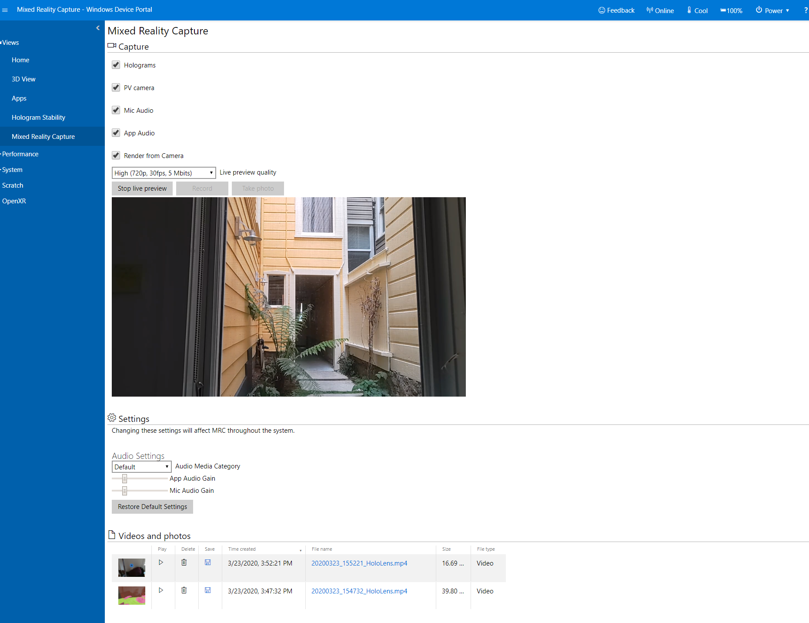

# What is HoloLens Device Portal?

**The Windows Device Portal for HoloLens** lets you configure and manage your device remotely over Wi-Fi or USB. The Device Portal is a web server on your HoloLens that you can connect to from a web browser on your PC. The Device Portal includes many tools that will help you manage your HoloLens and debug and optimize your apps.

## How to setup device portal?

* Turn on your HoloLens device. 
* Tab your wrist\(**HoloLens 2**\) or make a bloom gesture\(**HoloLens 1**\) to initiate Windows menu.

* Open the **Settings** &gt; **Update & Security.**

* Select **For Developers** tab on the right hand panel.

* Enable "**use developer features**" by toggling on/off button.
* Scroll down at the For Developer settings to enable "**Device Portal**".

* Go back to all settings page by clicking **"Home"** on the left hand panel and select **"Network & Internet"** settings.

* Select **"Wifi"** tab on the left, if it is not already selected.
* Select the wifi you are **connected** to and click on **"Advanced Options".**

* Scroll down and write down the **IPV4 address**.
* You will **type in this IP** address to your browser to reach to your device portal.
* You might see a connection Alert as shown below:

* Go ahead and click **Advanced** button and click **Proceed to &lt;your IP address&gt;\(unsafe\).**
* Congrats, you made it to your device portal. 

* Click **Views** on the right hand panel and select **"Live Preview"** to see the camera view of your HoloLens.

* You can **turn off PV camera** if you would like to share or record what you are seeing through your HoloLens but do not want to capture your environment.
* You can see the **videos recorded** or **screenshots** you snapped by asking **Cortana** here, on the **Videos and Photos** section, if you **enabled voice commands**. 

 

