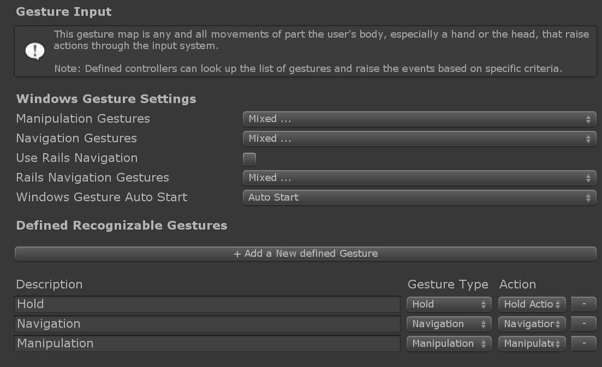

# What are Gestures?

**Gestures** are input events based on human **hands**. 

There are two types of devices that raise **gesture input events in Mixed Reality Toolkit\(MRTK\)**:

* Windows Mixed Reality devices such as HoloLens. This describes pinching motions \("Air Tap"\) and tap-and-hold gestures.  

[`WindowsMixedRealityDeviceManager`](https://microsoft.github.io/MixedRealityToolkit-Unity/api/Microsoft.MixedReality.Toolkit.WindowsMixedReality.Input.WindowsMixedRealityDeviceManager.html) wraps the [Unity XR.WSA.Input.GestureRecognizer](https://docs.unity3d.com/ScriptReference/XR.WSA.Input.GestureRecognizer.html) to consume Unity's gesture events from **HoloLens** devices.

* Touch screen devices. 

 [`UnityTouchController`](https://microsoft.github.io/MixedRealityToolkit-Unity/api/Microsoft.MixedReality.Toolkit.Input.UnityInput.html) wraps the [Unity Touch class](https://docs.unity3d.com/ScriptReference/Touch.html) that supports physical touch screens.

 Both of these input sources use the _Gesture Settings_ profile to translate Unity's Touch and Gesture events respectively into MRTK's [Input Actions](https://microsoft.github.io/MixedRealityToolkit-Unity/Documentation/Input/InputActions.html). This profile can be found under the _Input System Settings_ profile.

