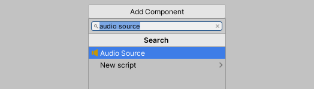
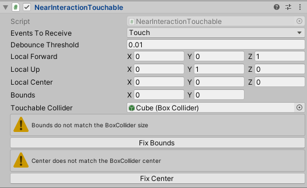
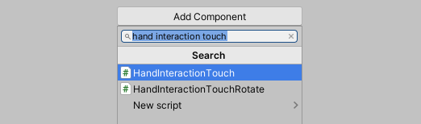
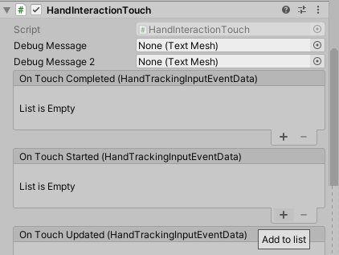
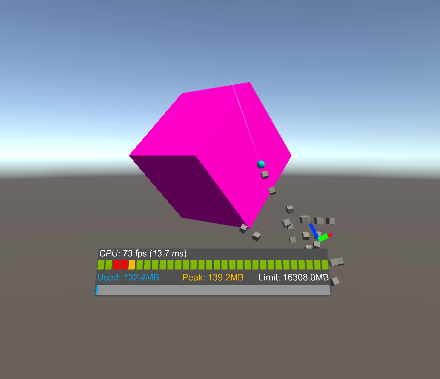

# How to Add Audio Feedback

You can configure an object to play a sound when the user touches an object by adding a **trigger touch event** to the object.

To be able to trigger touch events, the object must have the following components:

- Collider component, preferably a Box Collider
- Near Interaction Touchable (Script) component
- Hand Interaction Touch (Script) component

To add audio feedback, first add an **Audio Source** component to the object. The audio source component enables you to play audio back in the scene. In the Hierarchy window, select the object and click **Add Component** in the Inspector window. Search for **Audio Source** to add the **Audio Source** component.

Once the Audio Source component has been added to the object, in the Inspector window, change the **Spatial Blend** property to **1** to enable spatial audio.

Next, with the object still selected, click **Add Component** and search for the **Near Interaction Touchable (Script)**. Once found, select the component to add to the object. Near interactions come in the form of touches and grabs - which is an interaction that occurs when the user is within close proximity to an object and uses hand interaction.

After the **Near Interaction Touchable (Script)** is added to the object, click the **Fix Bounds** and **Fix Center** buttons. This will update the **Local Center** and **Bounds** properties of the **Near Interaction Touchable (Script)** to match the BoxCollider.

With the object still selected, click **Add Component** and search for the **Hand Interaction Touch (Script)**. Once found, select the component to add to the object.

To make audio play when the object is touched, you will need to add an **On Touch Started** event to the **Hand Interaction Touch (Script)** component. In the Inspector window, navigate to the **Hand Interaction Touch (Script)** component and click the small **+** icon to create a new **On Touch Started ()** event. 

Drag the object to receive the event and define **AudioSource.PlayOneShot** as the action to be triggered. **PlayOneShot** will play the audio clip.

Next, assign an audio clip to the trigger. You can find audio clips provided by MRTK by navigating to Assets > MixedRealityToolkit.SDK > StandardAssets > Audio. Once you've found a suitable audio clip, assign the audio clip to the **Audio Clip** field.

You can now test the touch interaction using the in-editor simulation. Press the **Play** button to enter Game mode. Once in Game mode, hold the spacebar to bring up the hand and use the mouse to touch the object and trigger the sound effect.

