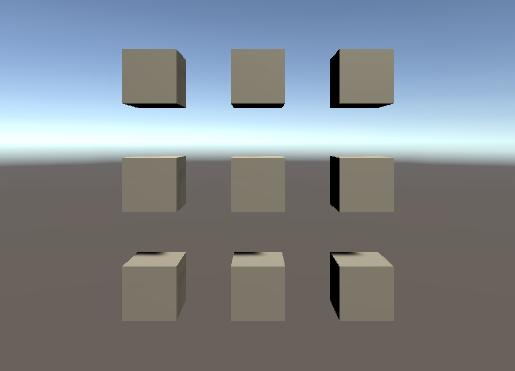
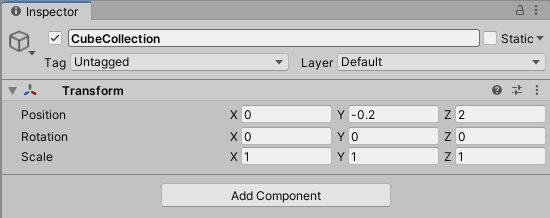
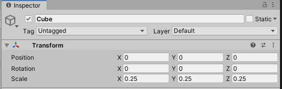
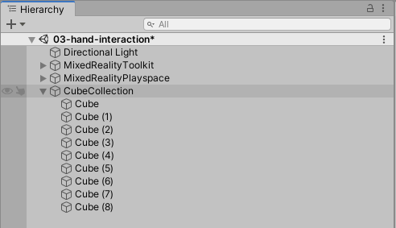
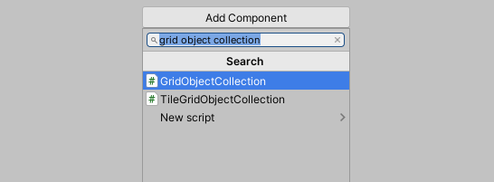
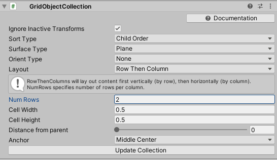

# How to organize your objects into a grid view?

You can organize any objects in Unity into a grid by using an **Object collection** script. In this example, you will learn how to organize 6 3D objects into a 3 x 3 grid.

First, configure your Unity scene for the Mixed Reality Toolkit. Next, in the Hierarchy window, right click in an empty space and select **Create Empty**. This will create an empty GameObject. Name the object **CubeCollection**.

In the Inspector window, position **CubeCollection** so that the collection displays in front of the user \(example, X = 0, Y = -0.2, Z = 2\).

With **CubeCollection** still selected, in the Hierarchy window, create a child **Cube** object. Change the scale of the object to x = .25, y = .25, z = .25.

Duplicate the child **Cube** object 8 times so that there is a total of 9 **Cube** child objects within the **CubeCollection** object.

In the Hierarchy window, select **CubeCollection**. In the Inspector window, click **Add Component** and search for the **Grid Object Collection \(Script\)**. Once found, select the component to add to the object.

Configure the **Grid Object Collection \(Script\)** component by changing the **Sort Type** property to **Child Order**. This will ensure that the child objects \(the 9 Cube objects\) are sorted in the order you placed them under the parent object.

Click **Update Collection** to apply the new configuration.

You can adjust the parameters within the **Grid Object Collection \(Script\)** component to further customize the grid. For example, you could change the number of rows to 2 by changing the value in the **Num Rows** properties. Be sure to click **Update Collection** to apply the new configuration.

