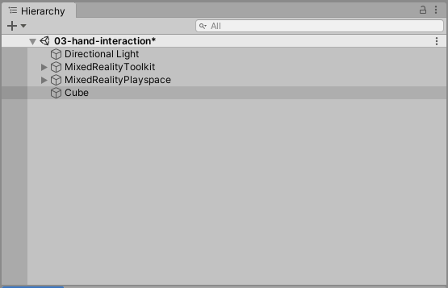

# How to add manipulation handler to your object

To be able to manipulate an object, the object must have the following components:

- Collider Component
- Manipulation Handler (Script) Component

Collider components define the shape of a GameObject for the purposes of physical collisions. A collider, which is invisible, does not need to be the exact same shape as the GameObject's mesh. A rough approximation of the mesh is often more efficient and indistinguishable in gameplay.

By default, the Collider component is automatically added when Unity primitives (cube, sphere, etc.) are created.

The ManipulationHandler script allows for an object to be made movable, scalable, and rotatable using one or two hands. Manipulation can be restricted so that it only allows certain kinds of transformation.

To add the **Manipulation Handler (Script)** component to an object, first select the object in the Hierarchy window.

In the Inspector window, click **Add Component** and search for **Manipulation Handler**. Select the **Manipulation Handler** script to apply the component to the object.

