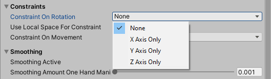

# How to rotate and scale an object

To rotate and scale an object, first ensure that the **Manipulation Handler (Script)** and **Near Interaction Grabbable (Script)** components are added to the object. The **Manipulation Handler (Script)** allows you to manipulate an object while the **Near Interaction Grabble (Script)** allows the object to respond to near hand interactions.

To add the scripts to the object, first select the object in the Hierarchy window. In the Inspector window, click **Add Component** and search for each script. Once found, select the script to add to the object.

With the object selected, in the Inspector window, navigate to the **Manipulation Handler (Script)** component to modify the component's parameters.

You can rotate an object using one or two hands. This setting is dependent on the **Manipulation Type** parameter. The **Manipulation Type** can be limited to either:
- One Handed Only
- Two Handed Only
- One and Two Handed

Select **Two Handed Only** for **Manipulation Type** so that the user can only manipulate the object with two hands.

To limit the two handed manipulation to rotating and scaling, change **Two Handed Manipulation Type** to **Rotate Scale**.

To limit whether the object can be rotated on the x, y or z axis, change **Constraint on Rotation** to your preferred axis.

You can now test rotating and scaling the object using the in-editor simulation. Press the **Play** button to enter Game mode. Once in Game mode, press **T** and **Y** on the keyboard to toggle both hands. This will permanently display both hands in Game mode. Press the spacebar to move the right hand and use left mouse click + **Shift** to move the left hand. While either controlling the left or right hand, use the mouse to rotate and scale the objet.

