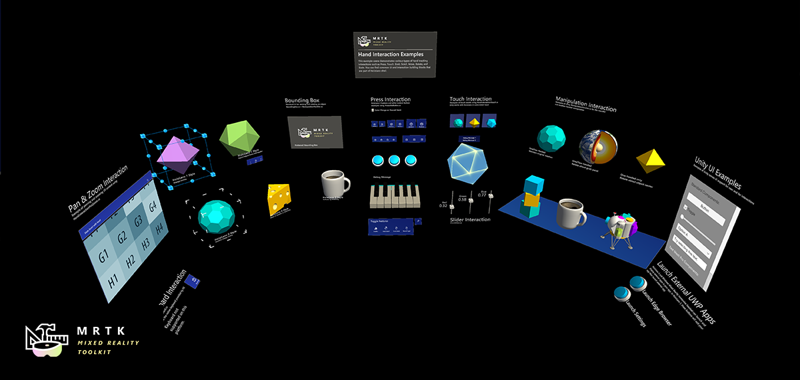
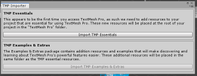

# How to run the \(Mixed Reality Toolkit\)MRTK Hand Interaction examples in Unity Editor?

The **HandInteractionExamples.unity** example scene contains various types of interactions and UI controls that highlight articulated hand input.

To try the hand interaction scene, first open the **HandInteractionExamples** scene under Assets\MixedRealityToolkit.Examples\Demos\HandTracking\Scenes\HandInteractionExamples

This example scene uses TextMesh Pro. If you receive a prompt asking you to import **TMP Essentials**, select the **Import TMP Essentials** button. Some of the MRTK examples use TMP Essentials for improved text rendering. After you select **Import TMP Essentials**, Unity will then import the package.

After Unity completes the import, close the TMP Importer window and reload the scene. You can reload the scene by double-clicking the scene in the Project window.

After the scene is reloaded, press the Play button.

