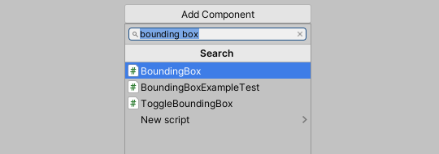
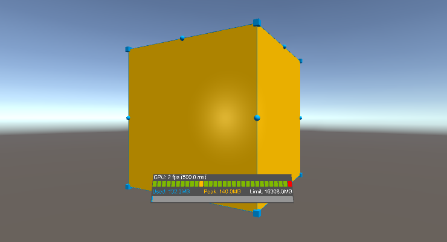
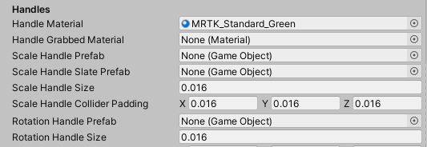
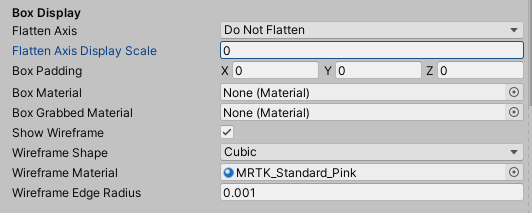
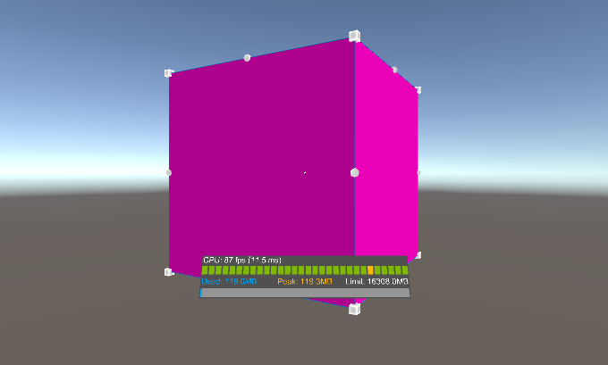
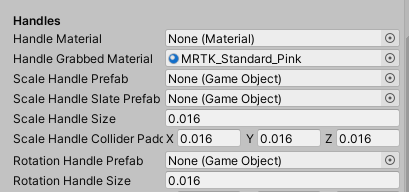
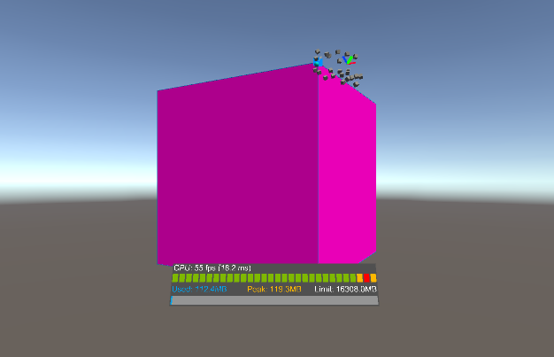
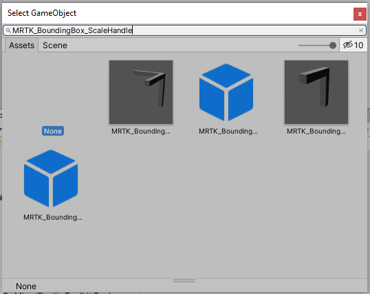
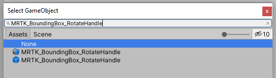

# How to Style Bounding Box

Bounding boxes make it easier and more intuitive to manipulate objects with one hand for both near and far interaction by providing handles that can be used for scaling and rotating. A bounding box will show a cube around the hologram to indicate that it can be interacted with. The bounding box also reacts to user input.

You can add a bounding box to an object by adding the BoundingBox.cs script as a component of the object.

To add the **Bounding Box (Script)** component to an object, first select the object in the Hierarchy window. In the Inspector window, click **Add Component** and search for **Bounding Box**.

Select the **Bounding Box** script to apply the component to the object. The bounding box is only visible in Game mode. Press play to view the bounding box. By default, the HoloLens 1st gen style is used.

To reflect the MRTK bounding box style, you need to change the parameters inside the **Handles** section of the **Bounding Box (Script)** component.

## Change Handle Color

You can change the color of the handles by assigning a material to the **Handle Material** property.

In the **Handles** section, click the circle icon to open the **Select Material** window.

In the **Select Material** window, search for **BoundingBoxHandleWhite**. Once found, select to assign the color to the handle material.

When you press play, the handle colors for the bounding box will be white.

## Change Handle Color When Object is Grabbed

You can change the color of the handles when an object is grabbed by assigning a material to the **Handle Grabbed Material** property.

In the **Handles** section, click the circle icon to open the **Select Material** window.

In the **Select Material** window, search for **BoundingBoxHandleBlueGrabbed**. Once found, select to assign the color to the handle material.

When you press play, grab one of the handles of the bounding box. The color of the handle will change to blue.

## Change Scale Handles

You can change the scale handles in corners by assigning a scale handle prefab in the **Scale Handle Prefab** and **Scale Handle Slate Prefab** (for 2D slate) parameters.

First, assign a prefab to the **Scale Handle Prefab**. In the **Handles** section, click the circle icon to open the **Select GameObject** window.

In the **Select GameObject** window, switch to the **Assets** tab and search for **MRTK_BoundingBox_ScaleHandle**. Once found, select to assign the prefab to the scale handle.

Next, assign a prefab to the **Scale Handle Slate Prefab**. In the **Handles** section, click the circle icon to open the **Select GameObject** window.

In the **Select GameObject** window, switch to the **Assets** tab and search for **MRTK_BoundingBox_ScaleHandle_Slate**. Once found, select to assign the prefab to the scale handle.

When you press play, grab one of the handles of the bounding box to see the change in how the scale handle look.

## Change Rotation Handles

You can change the rotation handles by assigning a rotation handle prefab in the **Rotation Handle Prefab** parameter.

In the **Handles** section, click the circle icon to open the **Select GameObject** window.

In the **Select GameObject** window, switch to the **Assets** tab and search for **MRTK_BoundingBox_RotateHandle**. Once found, select to assign the prefab to the scale handle.

When you press play, grab one of the handles of the bounding box to see the change in how the scale handle look.

