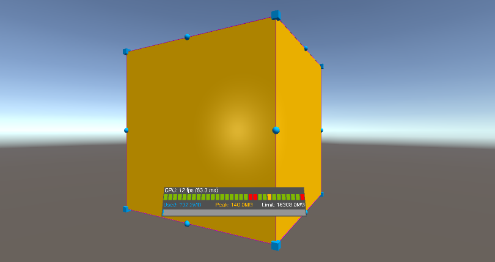
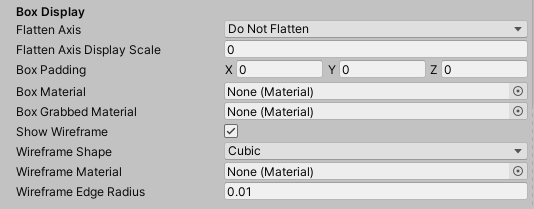
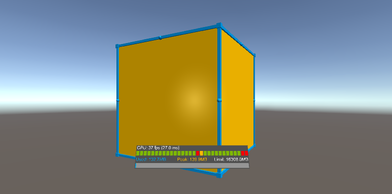

# How to Style Bounding Box

Bounding boxes make it easier and more intuitive to manipulate objects with one hand for both near and far interaction by providing handles that can be used for scaling and rotating. A bounding box will show a cube around the hologram to indicate that it can be interacted with. The bounding box also reacts to user input.

You can add a bounding box to an object by adding the BoundingBox.cs script as a component of the object.

To add the **Bounding Box (Script)** component to an object, first select the object in the Hierarchy window. In the Inspector window, click **Add Component** and search for **Bounding Box**.

Select the **Bounding Box** script to apply the component to the object. The bounding box is only visible in Game mode. Press play to view the bounding box.

## Change Wireframe Color

You can change the color of the wireframe (the bounding box lines) by assigning a material to the **Wireframe Material** property.

In the **Box Display** section, drag a new material to the **Wireframe Material** parameter.

When you press play, the wireframe for the bounding box will be the color you dragged into the **Wireframe Material** parameter.

## Change Wireframe Thickness

You can adjust the thickness of the wireframe by modifying the value for the **Wireframe Edge Radius** property.

In the **Box Display** section, change the value for the **Wireframe Edge Radius** parameter to **0.01**.

When you press play, the wireframe for the bounding box will thicker than the default thinner wireframe.

## Change Handle Color

You can change the color of the handles by assigning a material to the **Handle Material** property.

In the **Handles** section, drag a new material to the **Handle Material** parameter.

When you press play, the handles for the bounding box will be the color you dragged into the **Handle Material** parameter.

## Change Handle Color When Object is Grabbed

You can change the color of the handles when an object is grabbed by assigning a material to the **Handle Grabbed Material** property.

In the **Handles** section, drag a new material to the **Handle Grabbed Material** parameter.

When you press play, grab oen of the handles of the bounding box. The color of the handle will change to the color you dragged into the **Handle Grabbed Material** parameter.

