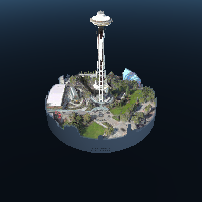

# 05 - Map Visualization

### Overview

**Shortlink**: [aka.ms/UnityBingMapsVisualizationLesson](https://aka.ms/UnityBingMapsVisualizationLesson)


This project is for **HoloLens 2** and **Windows Mixed Reality Headsets**.


In this project, we will create a **3D Map visualization** using [Bing Maps Unity SDK](https://github.com/microsoft/MapsSDK-Unity?WT.mc\_id=github-mixedrealitycurriculum-ayyonet):[ aka.ms/BingMapsUnitySDK](https://aka.ms/BingMapsUnitySDK).

**Outings**, a sample app created by Bings Map SDK can be found on Microsoft Store for PC and HoloLens 1: [aka.ms/OutingsHoloLens1](https://aka.ms/OutingsHoloLens1)

### What we will build?

We will build the app in below video for **HoloLens 2**. You can render it for **Windows Mixed Reality Headset** and use **hand controllers** instead of **hand gestures**.


HoloLens 2 Bing Maps project end product.


