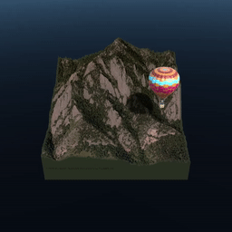

# What is Bing Maps SDK?

**Maps SDK, a Microsoft Garage project** provides a control to visualize a 3D map in Unity. The map control handles streaming and rendering of 3D terrain data with world-wide coverage. Select cities are rendered at a very high level of detail. Data is provided by Bing Maps.

The map control has been optimized for mixed reality applications and devices including the HoloLens, HoloLens 2, Windows Immersive headsets, HTC Vive, and Oculus Rift. Soon the SDK will also be provided as an extension to the [Mixed Reality Toolkit \(MRTK\)](https://github.com/Microsoft/MixedRealityToolkit-Unity).

