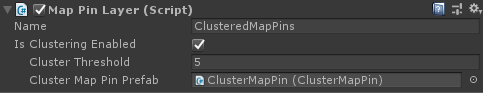

# How to add pins using the MapPinLayer?

This approach is better suited for **large data sets** where clustering may be required:

* Add a `MapPinLayer` component to the MapRenderer's GameObject. If clustering is enabled, check this setting on the layer and attach a prefab that has a ClusterMapPin component.



* In a script, get a reference to the `MapPinLayer` and add `MapPin` instances to the the layer's `MapPins` collection.

```csharp
foreach (var mapPinLocation in _maoPinLocations)
{
    var mapPin = Instantiate(_mapPinPrefab);
    mapPin.Location = mapPinLocation;
    _mapPinLayer.MapPins.Add(mapPin);
}​

```

### 

