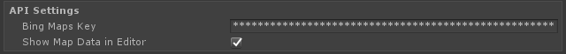
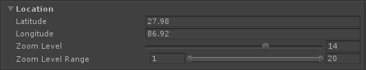

# How to create and configure your first map in unity?

After importing the SDK, to add a map to the scene...

1. Create a new **GameObject.**
2. Add a **MapRenderer** component to the GameObject: `Add component` -&gt; `Scripts` -&gt; `Microsoft.Maps.Unity` -&gt; `MapRenderer`
3. In the MapRenderer component, provide the **Bing Maps developer key**.

For the sample scenes, a Bing Maps developer key will also need to be provided in the MapRenderer.

Once the a valid key is provided, the map will render at runtime and in the editor as well.

 Once a valid key has been provided, the map will render in the editor as well, unless the `Show Map Data in Editor` option has been disabled.

### How to change Location and Zoom Level?

The view of the map can be configured in the **Location** foldout.

