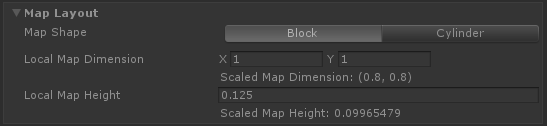
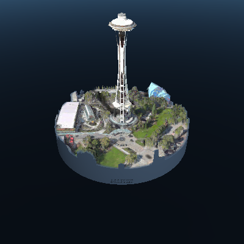
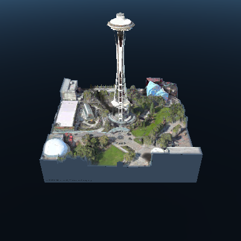

# How to style your map?

The **shape** and **dimension** of the map can be configured in the **layout** section.

The **shape** of the map can be a **block** or a **cylinder**. The default is block.

**Dimensions** are specified in **local space**. For convenience, the sizes scaled to **Unity's world space** are displayed in the editor as well.


**Larger map dimensions** will require more **data to be downloaded** and **rendered**. This will affect the overall performance of the app. It is recommended to stay with the default settings or smaller, or only increase the map dimensions on devices that are capable. Regardless, the map dimensions are clamped to a maximum size.


