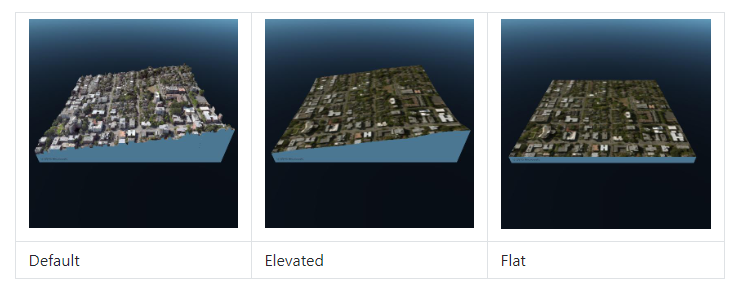

# What is a Map Terrain Type?

The type of terrain rendered by the map can be modified with the `MapTerrainType`.

* **Default**: The map terrain consists of either elevation data or high resolution 3D models.
* **Elevated**: The map terrain consists only of elevation data. No high resolution 3D models are used.
* **Flat**: Both elevation and high resolution 3D models are disabled. The map terrain surface will be flat.


 If the scenario does not require the higher resolution data, disabling the terrain can **improve performance**. Likewise, the **`Flat`** type requires the **least amount of performance overhead.**


