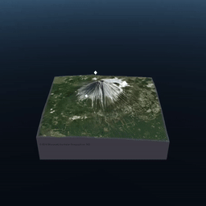

# What is clustering map pins means?

An advantage to using the MapPinLayer is that it supports clustering. If a ClusterMapPin prefab is specified on the layer, MapPins will be clustered automatically. When MapPins are clustered, the ClusterMapPin is shown in the place of the many MapPins that associate to it.

Clustering is highly recommended for large data sets as this will reduce the number of MapPin instances that need to be rendered for zoomed out views. Besides this rendering performance benefit, it is often preferable to cluster MapPins from a usability perspective since dense, cluttered views will make it more difficult for the user to interact with individual MapPins.

Clusters are created at every zoom level, so as the zoom level of the MapRenderer changes, the visible clusters and MapPins may change as well.

