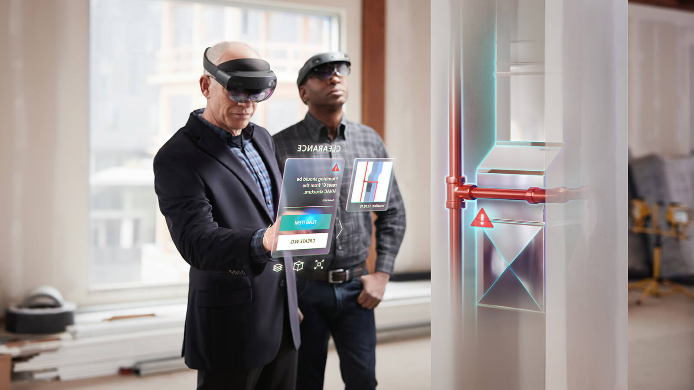

# Concepts

### What is a Spatial Anchor?

 Spatial Anchors allow you to place virtual object in a specific point in your real world. You can think of them as more accurate GPS that works indoors as well as outdoors. Spatial Anchors are available for iOS, Android mobile devices and HoloLens headsets. [Azure Spatial Anchors](https://docs.microsoft.com/azure/spatial-anchors/overview?WT.mc_id=talksAndWorkshops-github-ayyonet) gives you a way to save and share anchor points, so that you can share the virtual objects or information between multiple devices and persist them over time.

### Why use Spatial Anchors? 

Using [Azure Spatial Anchors](https://docs.microsoft.com/azure/spatial-anchors/overview?WT.mc_id=github-mixedrealitycurriculum-ayyonet) allows you to share any information in specific context, time and space. Some of the use cases are having user guides for machinery, inventory information, [way-finding applications](https://docs.microsoft.com/azure/spatial-anchors/concepts/anchor-relationships-way-finding?WT.mc_id=github-mixedrealitycurriculum-ayyonet), educational applications, [multi-player games](https://news.microsoft.com/features/beyond-the-blocks-how-the-latest-technology-made-minecraft-earth-a-reality/?WT.mc_id=github-mixedrealitycurriculum-ayyonet). Having smartphones and having access to the GPS data changed the apps we build and enabled ride sharing and location based recommendation applications. Developing with Azure Spatial Anchors will help you deliver contextual data at the right time and place and will open up new possibilities indoors.

### **Which devices does Azure Spatial Anchors support?**

Azure Spatial Anchors enables developers to build apps on [HoloLens](https://docs.microsoft.com/azure/spatial-anchors/quickstarts/get-started-hololens?WT.mc_id=github-mixedrealitycurriculum-ayyonet), on[ iOS ](https://docs.microsoft.com/azure/spatial-anchors/quickstarts/get-started-ios?tabs=openproject-swift&WT.mc_id=github-mixedrealitycurriculum-ayyonet)devices with ARKit support, and on [Android](https://docs.microsoft.com/azure/spatial-anchors/quickstarts/get-started-android?tabs=openproject-java&WT.mc_id=github-mixedrealitycurriculum-ayyonet) devices with ARCore support; for iOS and Android this includes both phones and tablets. 

### What do I need to do to make sure Android, iOS and HoloLens are using the same point as my anchor?

[To share Azure Spatial Anchors](https://docs.microsoft.com/azure/spatial-anchors/tutorials/tutorial-share-anchors-across-devices?tabs=VS%2CAndroid&WT.mc_id=github-mixedrealitycurriculum-ayyonet), SDK translate the local Spatial Anchor data into Azure Spatial Anchor format and saves it. Similarly, when a different platform asks for the same Spatial anchor data, the device will receive the anchor in platform's format. 

