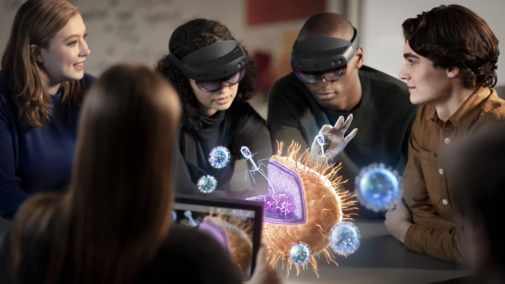

# Which devices does Azure Spatial Anchors support?

Azure Spatial Anchors enables developers to build apps on [HoloLens](https://docs.microsoft.com/azure/spatial-anchors/quickstarts/get-started-hololens?WT.mc_id=github-mixedrealitycurriculum-ayyonet), on[ iOS ](https://docs.microsoft.com/azure/spatial-anchors/quickstarts/get-started-ios?tabs=openproject-swift&WT.mc_id=github-mixedrealitycurriculum-ayyonet)devices with ARKit support, and on [Android](https://docs.microsoft.com/azure/spatial-anchors/quickstarts/get-started-android?tabs=openproject-java&WT.mc_id=github-mixedrealitycurriculum-ayyonet) devices with ARCore support; for iOS and Android this includes both phones and tablets. 

### 

