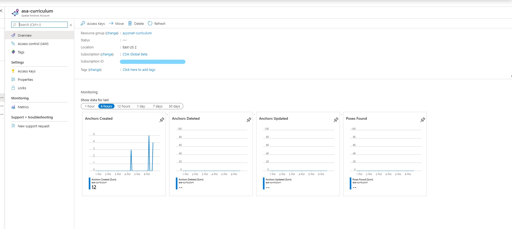

# How do I know my anchors are saved on Azure resources?

After you run your application, you can check to see the recently created anchors by navigating to the Azure Portal &gt; Spatial Anchor resource you have created for this tutorial.

