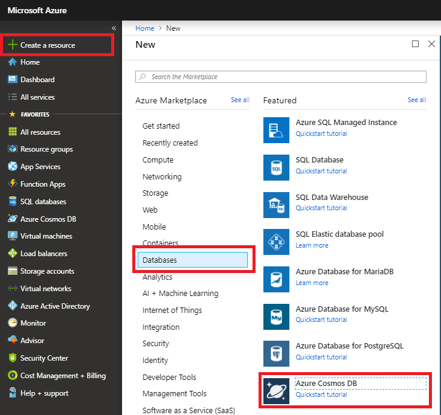

# How to create a CosmosDB table to save and share the anchors between devices?

* Sign in to your Azure Portal
* Create a resource by selecting Databases &gt; Azure CosmosDB

* Select the subscription  and resource group you are using for this project.
* Enter a unique name to identify Azure Cosmos DB account.
* Select **"Azure Table"** as the **API**.
* Select a geographic location to host your Azure Cosmos DB account. Use the location that's closest to your users to give them the fastest access to data.
* You can leave the **Geo-Redundancy** and **Multi-region Writes** options at their default values \(**Disable**\) to avoid additional RU charges. You can skip the **Network** and **Tags** sections.
* Select **Review+Create**. After the validation is complete, select **Create** to create the account.

*  It takes a few minutes to create the account. You'll see a message that states **Your deployment is underway**. Wait for the deployment to finish and then select **Go to resource**.

* Copy the `Connection String` for later use.
* Open `SharingService\Startup.cs.`
* Locate `#define INMEMORY_DEMO` at the top of the file and comment that line out. Save the file.
* Open `SharingService\appsettings.json`.
* Locate the `StorageConnectionString` property, and set the value to be the same as the `Connection String` value.

