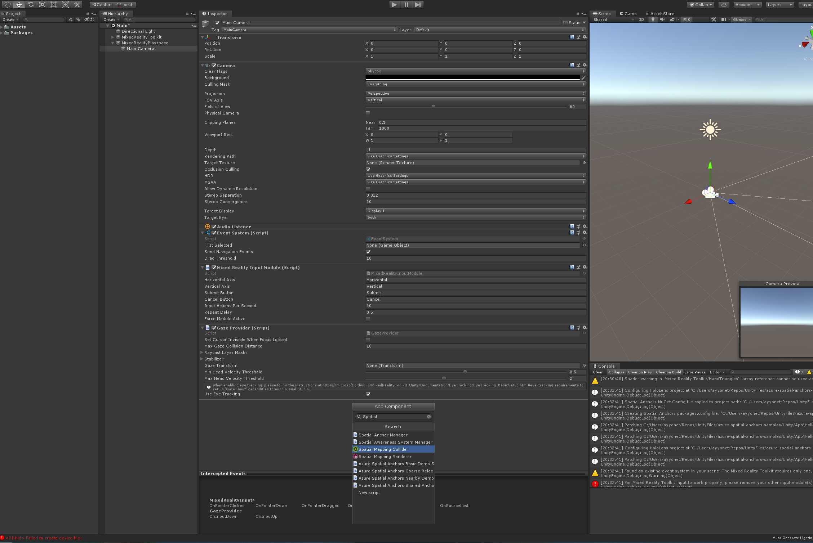

# How to create an Azure Spatial Anchor app and configure a scene?

* Start your project from [UnitySeedProject](../../lesson1/#how-to-get-started-with-hololens-seed-project).
* Work on main scene or[ create a new scene](../../lesson1/#how-to-create-a-new-scene) and [configure your scene with MRTK](../../lesson1/#how-to-configure-a-new-scene-with-mrtk).
* In the **Publishing Settings** Configuration section, check **InternetClientServer** and **SpatialPerception**.
* Add Spatial Mapping Collider component to your camera.

### 

