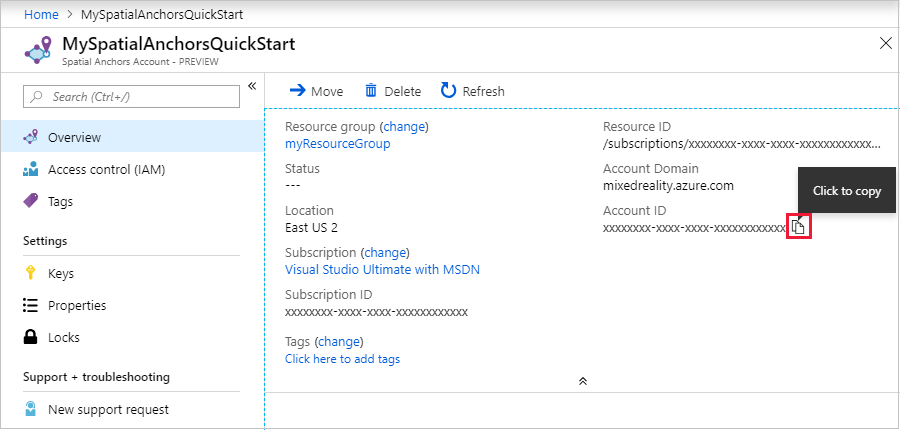
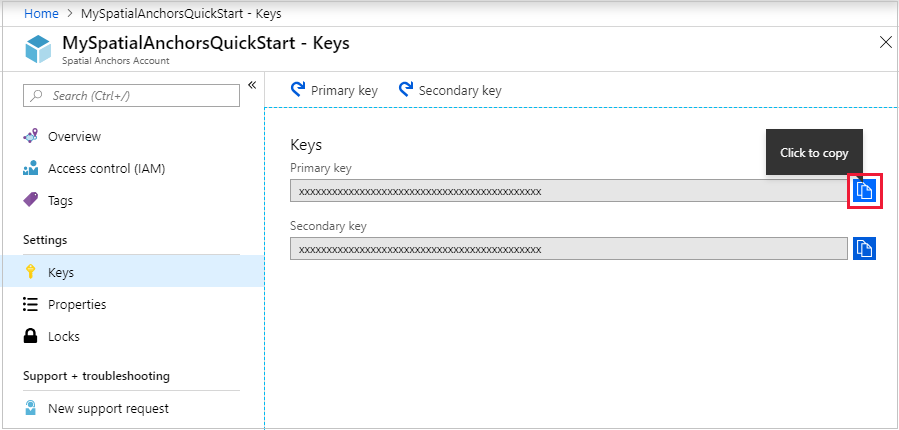

# How to create an Azure Spatial Anchor resources?

* Go to[ Azure Portal](https://portal.azure.com/?WT.mc\_id=github-mixedrealitycurriculum-ayyonet):[ **portal.azure.com**](https://portal.azure.com/?WT.mc\_id=github-mixedrealitycurriculum-ayyonet)**.**
* In the left navigation pane in the Azure portal, select **Create a resource**.
* Use the search box to search for **Spatial Anchors**.

* Select **Spatial Anchors**. In the dialog box, select **Create**.
* In the **Spatial Anchors Account** dialog box:
  * Enter a unique resource name, using regular alphanumeric characters.
  * Select the subscription that you want to attach the resource to.
  * Create a resource group by selecting **Create new**. Name it **myResourceGroup** and select **OK**. A [resource group](https://docs.microsoft.com/en-us/azure/azure-resource-manager/management/overview#terminology?WT.mc\_id=github-mixedrealitycurriculum-ayyonet) is a logical container into which Azure resources like web apps, databases, and storage accounts are deployed and managed. For example, you can choose to delete the entire resource group in one simple step later.
  * Select a location (region) in which to place the resource.
  * Select **New** to begin creating the resource.
* &#x20;After the resource is created, Azure Portal will show that your deployment is complete. Click **Go to resource**.

* &#x20;Then, you can view the resource properties. Copy the resource's **Account ID** value into a text editor because you'll need it later.

* &#x20;Under **Settings**, select **Key**. Copy the **Primary key** value into a text editor. This value is the `Account Key`. You'll need it later.

###
