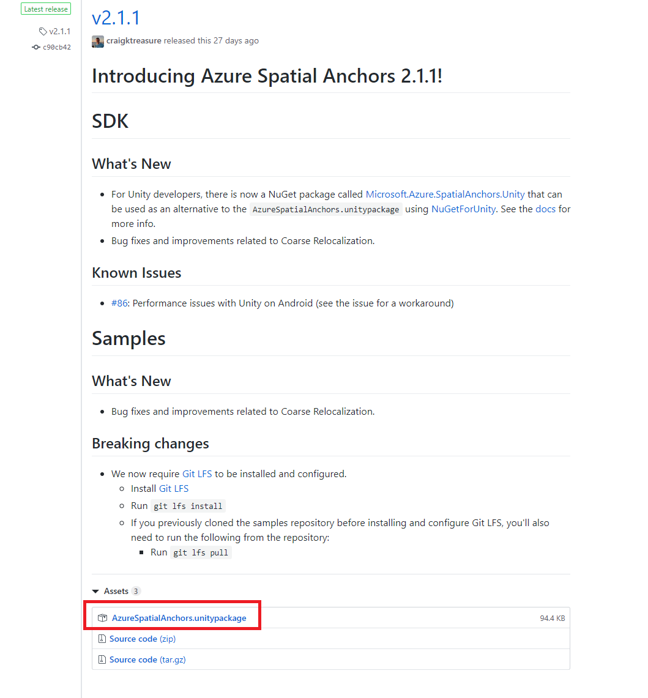

# How to include Azure Spatial Anchors\(ASA\) SDK to your project?

* Go to [Azure Spatial Anchors samples repo](https://github.com/Azure/azure-spatial-anchors-samples?WT.mc_id=github-mixedrealitycurriculum-ayyonet), [releases tab](https://github.com/Azure/azure-spatial-anchors-samples/releases?WT.mc_id=github-mixedrealitycurriculum-ayyonet).
* Scroll down to assets section and click on AzureSpatialAnchors.unitypackage to download.
* In your Unity project select Assets &gt; Import package &gt; custom package and find the downloaded AzureSpatialAnchors.unitypackage and import all.

### 

