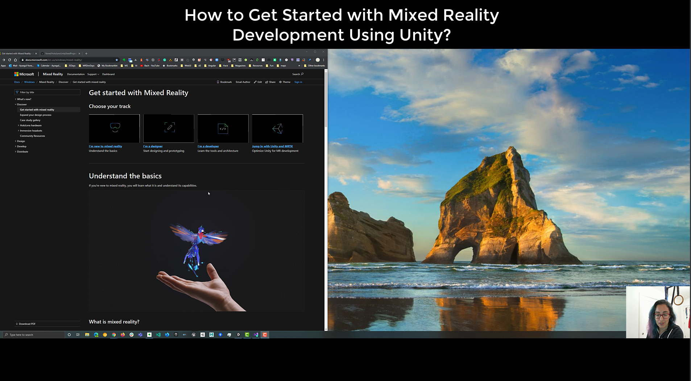

# 01 - Introduction to Mixed Reality

## Concepts

In this lesson, you will learn about the basic concepts about Mixed Reality and explore the applications of Mixed Reality in different industries. 

You will set up your first Mixed Reality project using Unity and Mixed Reality Tool Kit.

You can jump directly into setting up your first project here on the[ How to get started with mixed reality development using Unity3D](./#how-to-get-started-with-mixed-reality-development-using-unity) section. 

## [What is Mixed Reality?](../../what-is-mixed-reality.md) 

### Why is Mixed Reality important?

### [How do I decide if I need to develop for Virtual Reality or Augmented Reality?](https://twitter.com/WindowsDocs/status/1212766878235602944)

### [Will mixed reality replace our phones and PCs?](https://youtu.be/eqIu7HJeWSo)

### What kind of applications might benefit from immersive experiences?

### What are some use cases for Mixed Reality applications?

* [6 Use Cases for Enterprise Mixed Reality](https://www.kaleidoinsights.com/6-use-cases-for-enterprise-mixed-reality/)
* [5 Use Cases Of Augmented Reality That Boosted Businesses’ Sales](https://medium.com/swlh/5-use-cases-of-augmented-reality-that-boosted-businesses-sales-2114ac35bf5a)

### What are some examples of Mixed Reality Applications?

**Medical**

* [Incubator for Medical Mixed and Extended Reality at Stanford](http://med.stanford.edu/immers/relatedlabs.html)
* [Take a Ride on a Root Canal: The VR Tooth Tour Story](https://sketchfab.com/blogs/community/take-a-ride-on-a-root-canal-the-vr-tooth-tour-story/?utm_source=social&utm_medium=twitter&utm_campaign=blog-post&utm_content=Take%20a%20Ride%20on%20a%20Root%20Canal:%20The%20VR%20Tooth%20Tour%20Story)

**Museums and Libraries**

* [Mont-Saint-Michel: The historic 3D model comes to life](https://www.microsoft.com/inculture/arts/le-mont-saint-michel-mixed-reality/?ocid=AID746216_QSG_283790)
* [Apollo 11 Mission Unreal Engine Experience](https://youtu.be/C7QbR2d8RNI)
* [Dutch National Museum HoloLens Experience](https://www.youtube.com/watch?v=L9dcBfaJ2GY&feature=youtu.be)
* [Paris Museum HoloLens Experience](https://hololens.reality.news/news/microsofts-hololens-morphs-paris-museum-model-mont-saint-michel-into-masterpiece-ar-0190095/)
* [OneDome - Unreal Garden HoloLens Exhibition](https://youtu.be/ewwm7DgDip0)
* [Bouluvard HoloLens App](https://youtu.be/f3575f3DOOw)
* [Dinosaur Passage: A Hololens Museum Experience](https://youtu.be/Z-6CveTUFYY)
* [Smithsonian Apollo 11 Module VR](https://3d.si.edu/apollo11cm)
* [Making of Apollo 11 Module Experience](https://youtu.be/Xyiy2fiV_Mc)
* [Google I/O 2018 AR demo](https://developers.google.com/ar/develop/java/augmented-images/)
* [SF Moma movement controlled experience](https://www.frogdesign.com/work/sf-moma)
* [Google Augmented Reality museum experience](https://youtu.be/ASWqxIgR4L8)
* [MoMa Jackson Pollack](https://archinect.com/news/article/150061965/an-augmented-reality-art-exhibit-hijacks-moma-s-jackson-pollock-gallery)
* [DaVinci AR Layers Google IO 2018](https://youtu.be/MeZcQguH124?t=113)
* [Petersen Automotive Museum: a HoloLens experience](https://youtu.be/DdM786eiIa8)
* [Mixed Reality Museum Tour Solution with HoloLens](https://mspoweruser.com/company-offers-bespoke-mixed-reality-museum-tour-solution-using-the-microsoft-hololens/)
* [Experimenting with Mixed Reality in Museums](https://segd.org/experimenting-microsoft-mixed-reality-museums)
* [Explore WWII’s French Resistance in mixed reality](https://www.microsoft.com/inculture/arts/museum-liberation-of-paris-mixed-reality/)
* [Mixed Reality Museum in Kyoto: A unique insight into centuries-old Japanese artwork](https://news.microsoft.com/apac/features/mixed-reality-museum-kyoto-unique-insight-centuries-old-japanese-artwork/)
* [Catalina HoloLens Experience](https://mw18.mwconf.org/glami/catalina-hololens-experience/)
* [Museum Next: How Museums are using Augmented Reality](https://www.museumnext.com/article/how-museums-are-using-augmented-reality/)
* [Museum Next: Virtual Reality is a big trend in museums, but what are the best examples of museums using VR?](https://www.museumnext.com/article/how-museums-are-using-virtual-reality/)
* [Augmenting Museum Experiences with Mixed Reality](http://www.academia.edu/download/38879412/KSCE04HughesEtAl.pdf)

## Project

### [How to Get Started with Mixed Reality Development Using Unity?](https://www.youtube.com/watch?v=5Ri3mhvY1_U)

[https://youtu.be/5Ri3mhvY1\_U](https://youtu.be/5Ri3mhvY1_U)

### How to enable Developer Mode in HoloLens 1?

1. Turn on your HoloLens and put on the device.
2. Perform the [bloom](%20https://docs.microsoft.com/en-us/windows/mixed-reality/system-gesture#bloom?WT.mc_id=github-mixedrealitycurriculum-ayyonet) gesture to launch the main menu.
3. Gaze at the **Settings** tile and perform the [air-tap](https://docs.microsoft.com/en-us/windows/mixed-reality/gaze-and-commit#composite-gestures?WT.mc_id=github-mixedrealitycurriculum-ayyonet) gesture. Perform a second air tap to place the app in your environment. The Settings app will launch after you place it.
4. Select the **Update** menu item.
5. Select the **For developers** menu item.
6. Enable **Developer Mode**. This will allow you to [deploy apps from Visual Studio ](https://docs.microsoft.com/en-us/windows/mixed-reality/using-visual-studio?WT.mc_id=github-mixedrealitycurriculum-ayyonet)to your HoloLens.
7. Optional: Scroll down and also enable **Device Portal**. This will also allow you to connect to the [Windows Device Portal](https://docs.microsoft.com/en-us/windows/mixed-reality/using-the-windows-device-portal?WT.mc_id=github-mixedrealitycurriculum-ayyonet) on your HoloLens from a web browser.

### How to enable Developer Mode in HoloLens 2?

### How to enable Developer Mode for Android?

### [How to get started with Unity3D?](https://youtu.be/1O3rU4h8I80)

### How to get started with HoloLens Seed Project?

### How to create a new scene?

* On the Project panel, right click and select Create &gt; Scene.

* Name your scene and drag it under Scenes folder for organization purposes.

### How to configure a new scene with MRTK?

* Create a new scene.
* On the top bar, select **Mixed Reality Toolkit &gt; Add scene and configure**.

* You might be prompted to select a configuration. You can choose the default MRTK configuration or if you are developing for an HoloLens device, you can choose the configuration for the appropriate version.
* On your hierarchy panel, you will see **MixedRealityToolkit** and **MixedRealityPlayspace** drop downs along with your default directional light.
* Your scene camera is grouped underneath **MixedRealityPlayspace** dropdown and setup for Augmented Reality camera with a black background to render transparent. This will allow your device to stream your camera view and display your virtual objects on top. 

### How to create your first 3D scene with a camera, light and an object?

### What is Mixed Reality Toolkit\(MRTK\)?

### How to setup your Mixed Reality project with MRTK?

### How to build your project for HoloLens or Windows Mixed Reality Headset?

### How to deploy your app to a HoloLens?

### How to build your app for Android Device?

### How to deploy to an Android Device?

## What could go wrong?

## Further Reading

