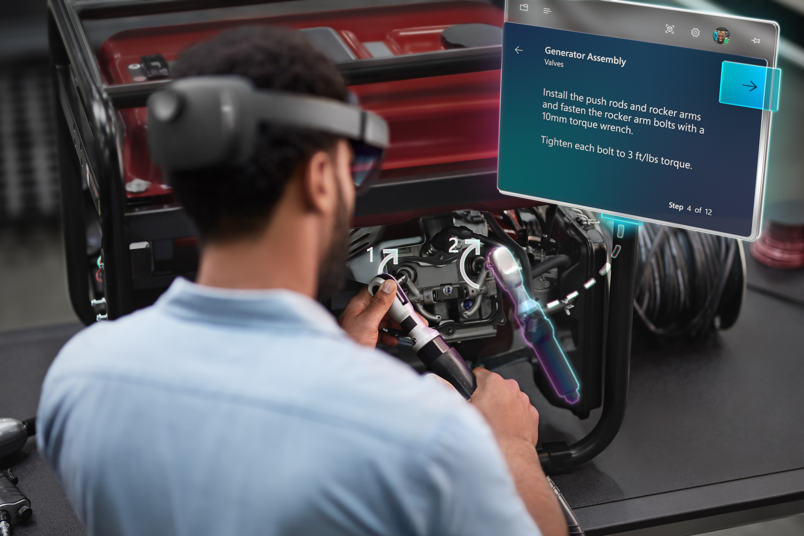
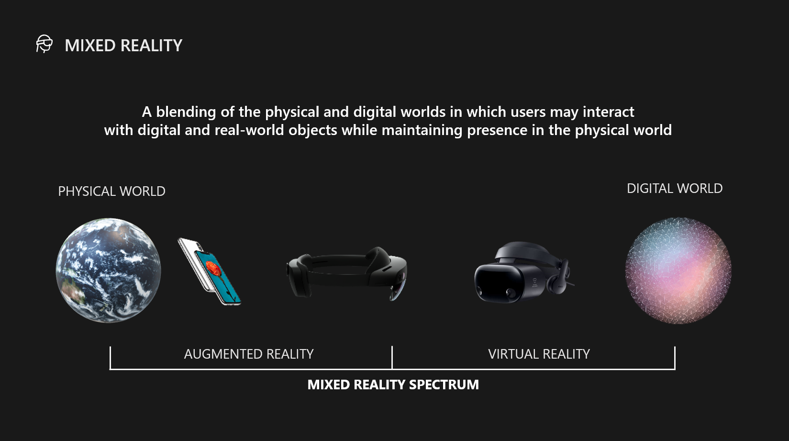

# What is Mixed Reality?

**Mixed reality** is the merging of **real** and **virtual worlds** to produce new environments and visualizations, where physical and digital objects co-exist and interact in real time.

We think of **Mixed reality** as a spectrum from **physical world** to **augmented world** to fully immersive **virtual world** and all the possibilities in between.

