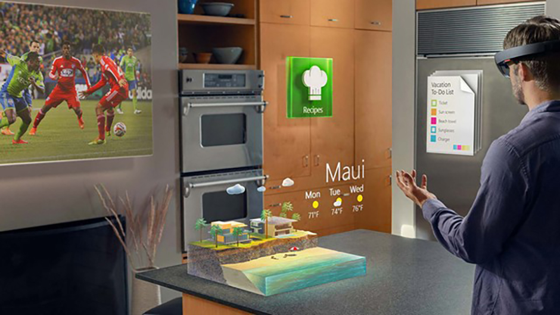
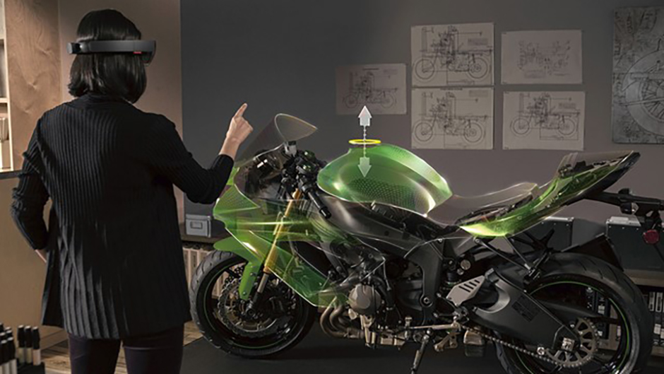
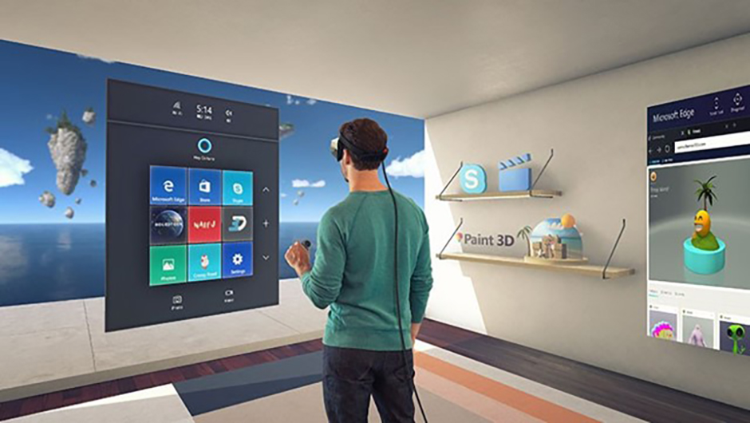

# What is the Best Reality for My App?

One of the advantages of developing apps for Windows Mixed Reality is that there is a spectrum of experiences that the platform can support.

## Physical Reality

One of the most powerful ways that mixed reality can bring value to users is by placing digital information or content in a user’s current environment or physical reality. This approach is popular for apps where the placement of digital content in the real world is important and/or keeping the user’s real world environment “present” during their experience is key. This approach also allows users to easily move from real world tasks to digital tasks and back easily which encourages the user to feel that the mixed reality apps are truly part of their environment.

[insert picture]

**Examples:**

- A mixed reality notepad style app that allows users to create and place notes around their environment
- A mixed reality television app placed in a comfortable spot for viewing
- A mixed reality cooking app placed above the kitchen island to assist in a cooking task
- A mixed reality app that gives users the feeling of “x-ray vision” (i.e. a hologram placed on top of and mimics a real world object, while allowing the user to see “inside it” holographically)
- Mixed reality annotations placed throughout a factory to give worker’s necessary information
- Mixed reality wayfinding in an office space
- Mixed reality tabletop experiences (i.e. board game style experiences)
- Mixed reality communication apps like Skype

## Fully Mixed Reality

Given Windows Mixed Reality’s ability to recognize and map the user's environment, it is capable of creating a digital layer that can be completely overlaid on the user’s space. The app respects the shape and boundaries of the user’s environment, however, the app may choose to transform certain elements best suited to immerse the user in the app.

Fully mixed reality apps may only care enough about the environment to best use its makeup for encouraging specific user behavior (like encouraging movement or exploration) or by replacing elements with changes (a kitchen counter is virtually skinned to show a different tile pattern). This type of experience may even transform an element into an entirely different object, but still retain the rough dimensions of the object as its base (a kitchen island is transformed into a dumpster for a crime thriller game).

**Examples:**

- A mixed reality interior design app that can paint walls, countertops or floors in different colors and patterns
- A mixed reality app that allows an automotive designer to layer new design iterations for an upcoming car refresh on top of an existing car
- A bed is “covered” and replaced by a mixed reality fruit stand in children’s game
- A desk is “covered” and replaced with a mixed reality dumpster in a crime thriller game
- A hanging lantern is “covered” and replaced with signpost using roughly the same shape and dimension
- An app that allows users to blast holes in their real or immersive world walls, which reveal a magical world

## Digital Reality

Digital reality apps are centered around an environment that completely changes the user’s world and can place them in a different time and space. These environments can feel very real, creating immersive and thrilling experiences that are only limited by the app creator’s imagination. Once Windows Mixed Reality identifies the user’s space, the user is immersed in a completely digital environment, unaware of what occurs in the physical environment around them. These experiences may also completely separate time and space, meaning a user could walk the streets of Rome in an immersive experience, while remaining relatively still in their real world space. Context of the real world environment may not be important.

**Examples:**

- An immersive app that lets a user tour a space completely separate from their own (i.e. walk through a famous building, museum, popular city)
- An immersive app that orchestrates an event or scenario around the user (i.e. a battle or a performance)