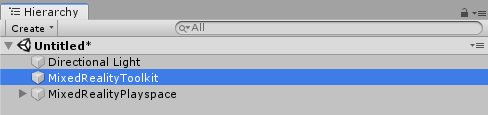
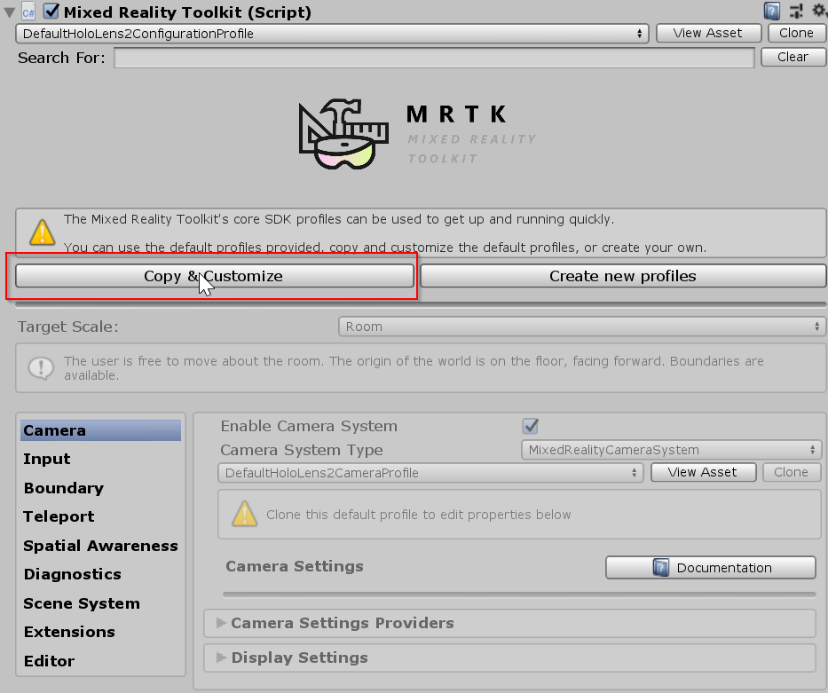
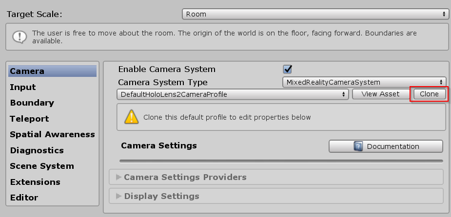
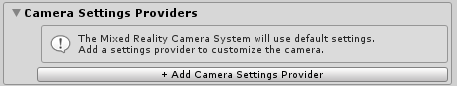
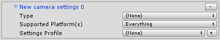
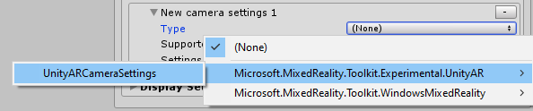

# How to set up your project for iOS or Android\[Experimental\]?

**1 \)** Make sure you have imported  **Microsoft.MixedReality.Toolkit.Unity.Foundation** as a custom asset or through NuGet. 

**2 \)** In the Unity Package Manager \(UPM\), install the following packages:

| Android | iOS |
| :--- | :--- |
| AR Foundation Version: 2.1.4 | AR Foundation Version: 2.1.4 |
| ARCore XR Plugin Version: 2.1.2 | ARKit XR Plugin Version: 2.1.2 |

**3 \)** Enabling the Unity AR camera settings provider.

The following steps presume use of the MixedRealityToolkit object. Steps required for other service registrars may be different.

1. Select the **MixedRealityToolkit** object in the scene hierarchy.

  2. Select **Copy and Customize** to Clone the MRTK Profile to enable custom configuration.

 3.  Select **Clone** next to the Camera Profile.

4.  Navigate the Inspector panel to the camera system section and expand the **Camera Settings Providers** section.

 5.  Click **Add Camera Settings Provider** and expand the newly added **New camera settings** entry.

 6. Select the Unity AR Camera Settings provider from the Type drop down.

