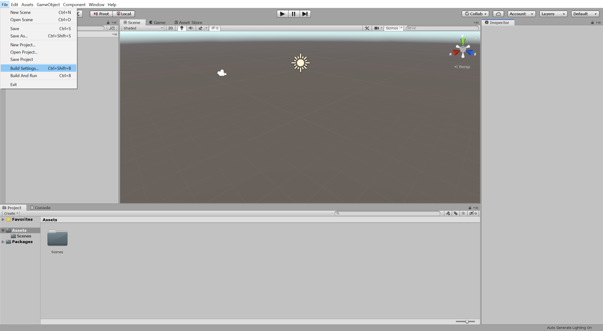
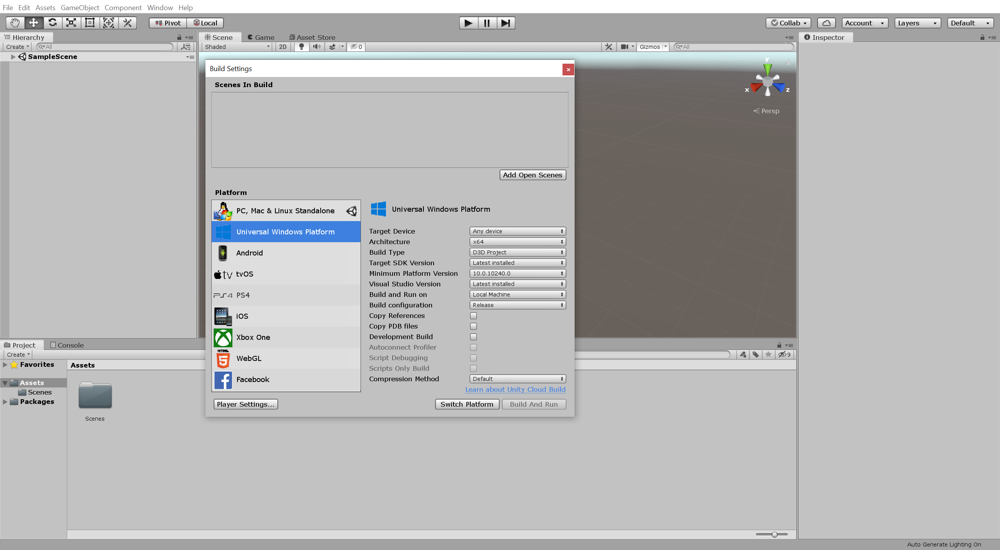
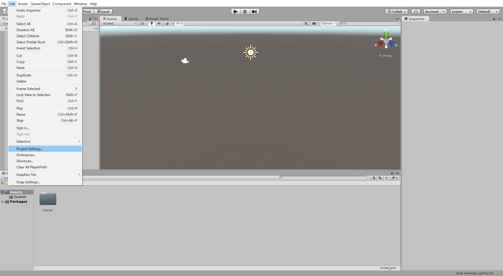
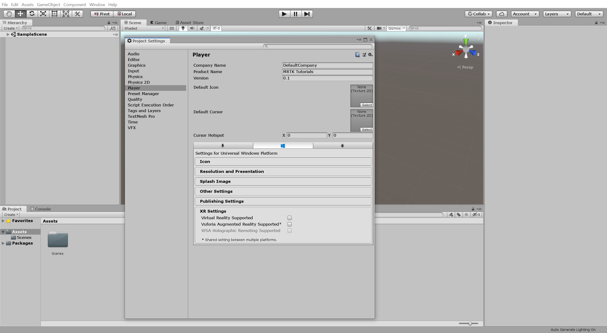
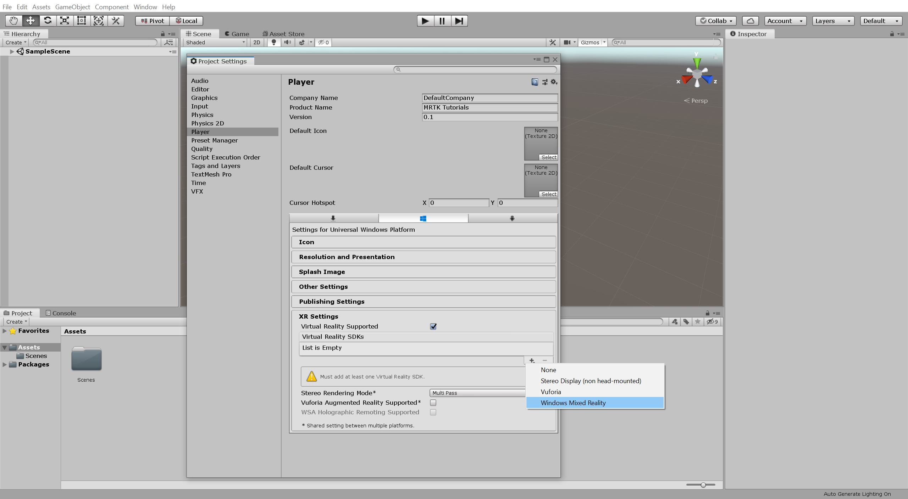
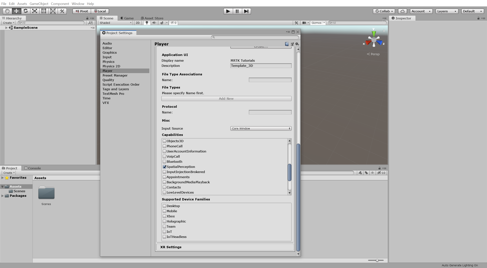
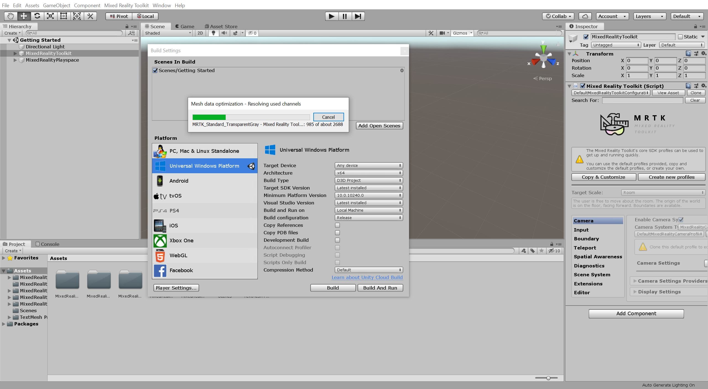

# How to build your project for HoloLens?

* In the Unity menu, select **File** &gt; **Build Settings...** to open the Build Settings window.

*  In the Build Settings window, select **Universal Windows Platform** and click the **Switch Platform** button.

*  Click on **Project Settings** in the **Build Settings window** or the **Unity menu**, select **Edit** &gt; **Project Settings...** to open the Project Settings window.

* In the Project Settings window, select **Player** &gt; **XR Settings** to expand the XR Settings.

*  In the XR Settings, check the **Virtual Reality Supported** checkbox to enable virtual reality, then click the **+** icon and select **Windows Mixed Reality** to add the Windows Mixed Reality SDK.


Your projects settings might have been configured by Mixed Reality Toolkit.


* Optimize the XR Settings as follows:
  * Set Windows Mixed Reality **Depth Format** to **16-bit depth.**
  * Check the Windows Mixed Reality **Enable Depth Sharing** checkbox.
  * Set Stereo **Rendering Mode\*** to **Single Pass Instanced.**

*  In the Project Settings window, select **Player** &gt; **Publishing Settings** to expand the Publishing Settings. Scroll down to the **Capabilities** section and check the **SpatialPerception** checkbox.

Save your project and open up the Build Settings. Click on Build button, not Build and Run. When prompted, create a new folder\(ex:HoloLensBuild\) and select your new folder to build your files into.


Click on Build button, not Build and Run.


