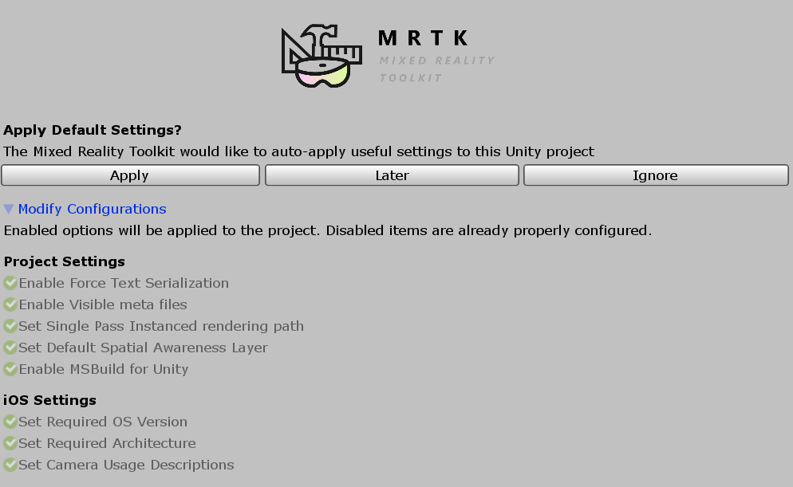
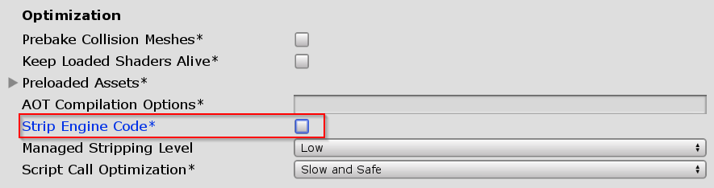

# How to build your scene for Android and iOS Devices?

* [ ] Make sure you have added the UnityAR Camera Settings Provider to your scene.
* [ ] Switch platform to either Android or iOS in the Unity Build Settings

  When you switch the platform you should see the MRTK Project Configurator Window with settings for your chosen platform. Click Apply to enable platform specific settings.

  iOS Project Configurator Settings.


There are no additional steps after switching the platform for Android.


* [ ]  If the platform is iOS, Edit &gt; Project Settings &gt; Player &gt; Other Settings, under the Optimization header, **uncheck** Strip Engine Code


 Unchecking Strip Engine Code is the short term solution to an error in Xcode [\#6646](https://github.com/microsoft/MixedRealityToolkit-Unity/issues/6646). We are working on a long term solution.


* [ ] Build and Run your scene to your device.

