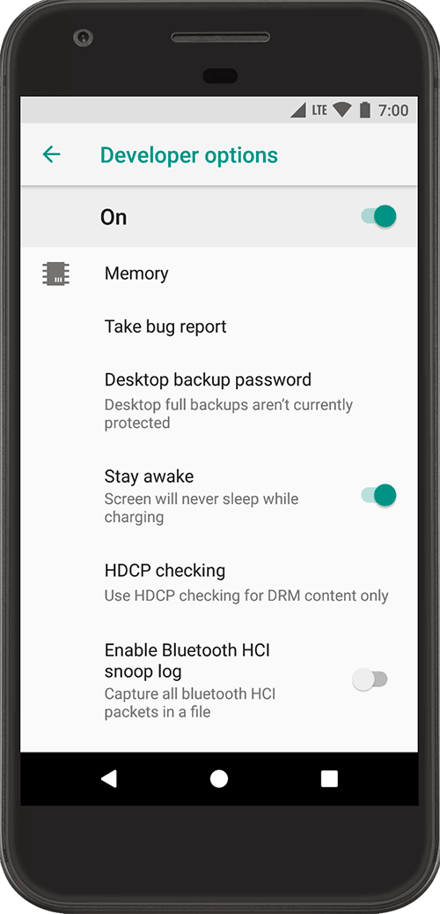

# How to enable Developer Mode on an Android Device?

   The Settings app on Android includes a screen called **Developer options** that lets you configure system behaviors that help you profile and debug your app performance. For example, you can enable debugging over USB, capture a bug report, enable visual feedback for taps, flash window surfaces when they update, use the GPU for 2D graphics rendering, and more.

### Enable developer options and USB debugging 

On Android 4.1 and lower, the **Developer options** screen is available by default. On Android 4.2 and higher, you must enable this screen. To enable developer options, tap the **Build Number** option 7 times. You can find this option in one of the following locations, depending on your Android version:

* Android 9 \(API level 28\) and higher: **Settings &gt; About Phone &gt; Build Number**
* Android 8.0.0 \(API level 26\) and Android 8.1.0 \(API level 26\): **Settings &gt; System &gt; About Phone &gt; Build Number**
* Android 7.1 \(API level 25\) and lower: **Settings &gt; About Phone &gt; Build Number**

At the top of the **Developer options** screen, you can toggle the options on and off \(figure 1\). You probably want to keep this on. When off, most options are disabled except those that don't require communication between the device and your development computer.

Before you can use the debugger and other tools, you need to enable USB debugging, which allows Android Studio and other SDK tools to recognize your device when connected via USB. To enable USB debugging, toggle the **USB debugging** option in the Developer Options menu. You can find this option in one of the following locations, depending on your Android version:

* Android 9 \(API level 28\) and higher: **Settings &gt; System &gt; Advanced &gt; Developer Options &gt; USB debugging**
* Android 8.0.0 \(API level 26\) and Android 8.1.0 \(API level 26\): **Settings &gt; System &gt; Developer Options &gt; USB debugging**
* Android 7.1 \(API level 25\) and lower: **Settings &gt; Developer Options &gt; USB debugging**

The rest of this page describes some of the other options available on this screen.

