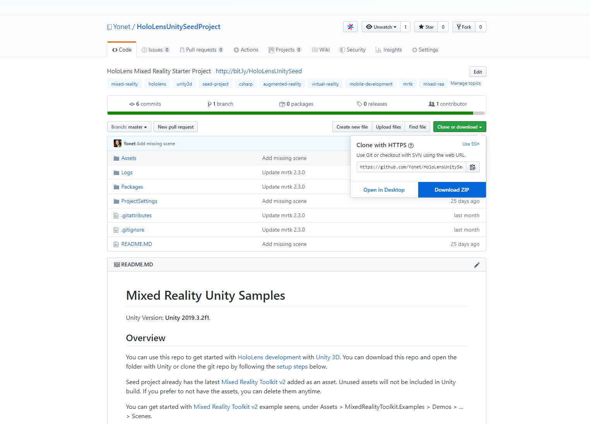

# How to get started with HoloLens Seed Project?

\*\*\*\*[**HoloLens Seed** project](https://github.com/Yonet/HoloLensUnitySeedProject) is a github repository that is configured for **Windows Mixed Reality development**. The repo includes **Mixed Reality Toolkit** and **.gitignore** files. 

You can create a new project from the seed instead of downloading the different assets and setting up your git project. To be able to use the seed project, you can [get a github account](https://github.com/?WT.mc_id=github-mixedrealitycurriculum-ayyonet) and setup your development environment or directly download the repository content.



## Setup

You can clone and delete this repository's history and start a new git project by running the below script. You need to create your own github repo first. Replace with your own github project url.

```text
git clone --depth=1 https://github.com/Yonet/HoloLensUnitySeedProject.git <your-project-name>
```

Or by running the below github commands:

```text
// Clone the seed project
git clone --depth=1 https://github.com/Yonet/HoloLensUnitySeedProject.git

-- Remove the history from the repo
rm -rf .git

-- recreate the repos from the current content only
git init
git add .
git commit -m "Initial commit"

-- push to the github remote repos ensuring you overwrite history
git remote add origin git@github.com:<YOUR ACCOUNT>/<YOUR REPOS>.git
git push -u --force origin master
```

