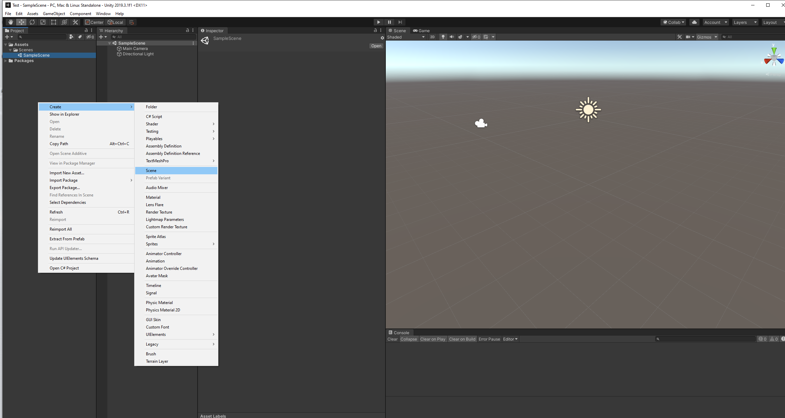
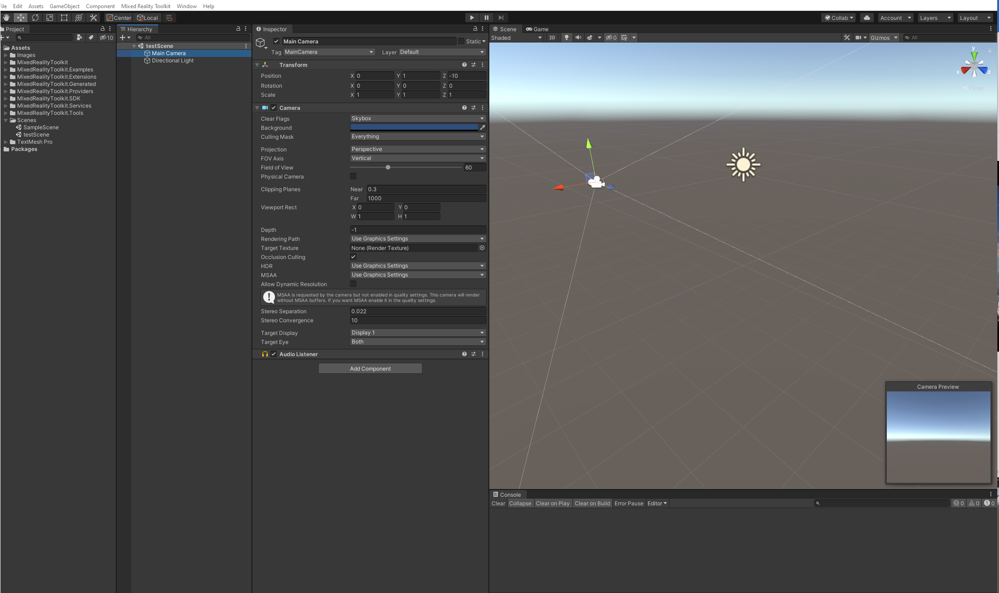

# How to Get Started with Mixed Reality Development Using Unity?



### How to create a new scene?

* On the Project panel, right click and select Create &gt; Scene.
* Name your scene and drag it under Scenes folder for  organization purposes.

Every new Scene comes with a **light** and **camera**. We have to modify the camera later for our Mixed Reality project.

